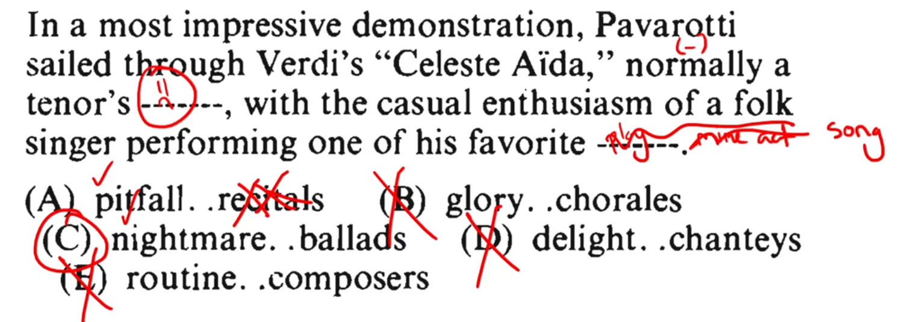

### Although adolescent maturational and developmental states occur in orderly sequence, their timing _____ with regard in onset and duration. 
- contrasts with orderly. 
- guess: varies. 

### A leading chemist believes that many scientists have difficulty with stereochemistry because much of the relevant nomenclature is ________, in that it combines concepts that should be kept _______.
- should be shows contrast with combines, first blank shows support of difficulty with.
- guess: complex/convoluted ; separate. 

### The self important cant of musicologists on record jackets often suggests that true appreciation of the music is an ______ process closed to the uninitiated listener, however enthusiastic. 
- blank supports closed ot the uninitiated. 
- guess: arcane

### Change of fashion and public taste are often _____ and resistant to analysis, and yet they are among the most _______ gauges of the state of the public's collective consciousness. 
- first blank supports resistant to analysis. second blank contradicts the first statement, contrasts resistant to analysis. 
- Guess: arbitrary/unpredictable/obscure ; accurate/effective. 
- Answer: ephemeral : reliable

### In a most impressive demonstration, Pavarotti sailed through Verdi's "Celeste Aida," normally a tenor's ______, with the casusal enthusiasm of a folk singer performing one of his favorite _____.
- Guess: ; 
- First blank is a bad thing, since normally implies contrast and sailing throught something is good.  

- Connotation suggests first blank is bad, so 3 options are cancelled, remaining options are done by semantics, recitals don't make sense for folk singer.

### Cynics belive that people who _____ compliments do so in order to be praised twice. 
- Guess: reject/argue.

### Although the revelation that one of the contestants was a friend left the judge open to charge of lack of _______, the judge remained adamant in her assertion that acquaintance did not necessarily imply _______. 
- Guess: fairness/(lack of bias) : collusion/cheating.