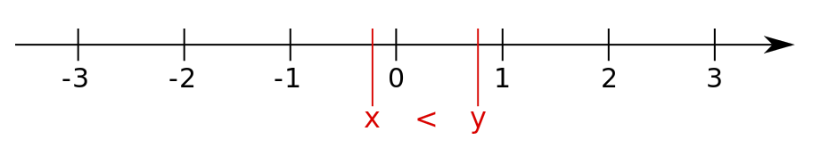
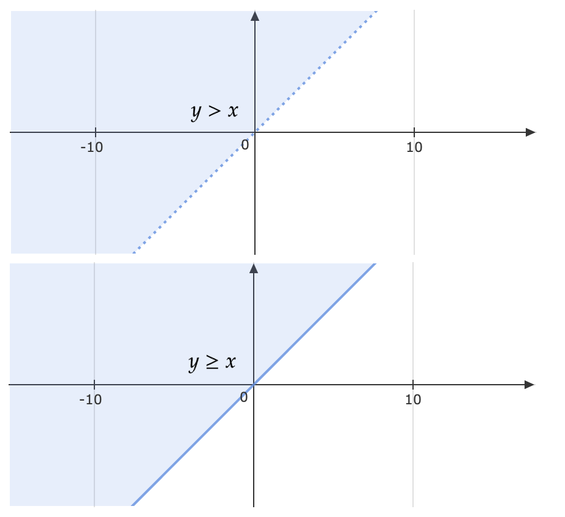
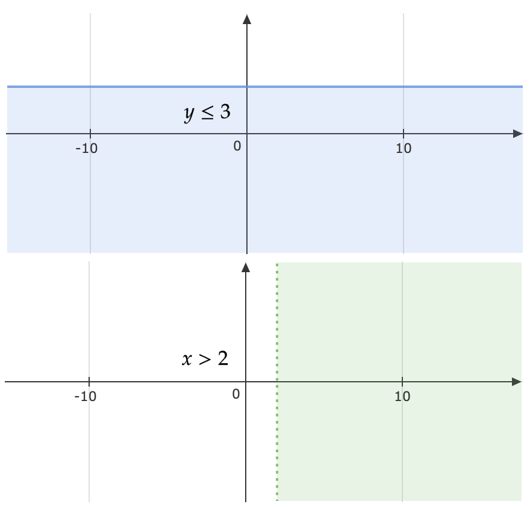
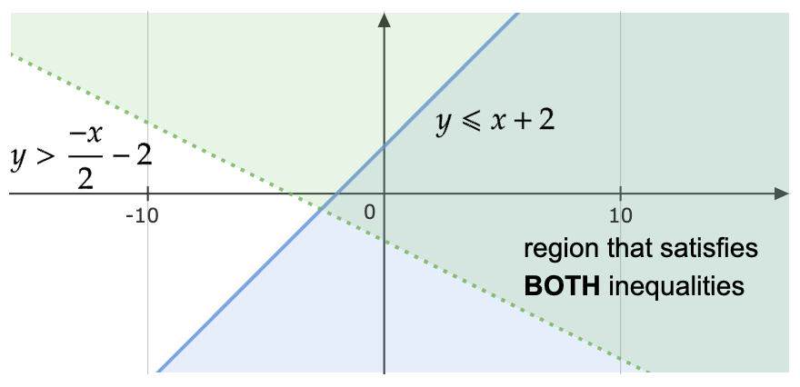
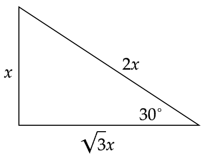
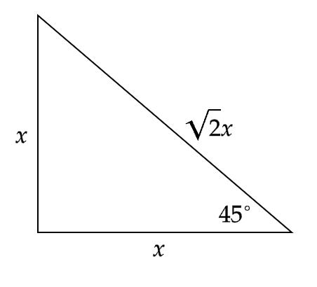
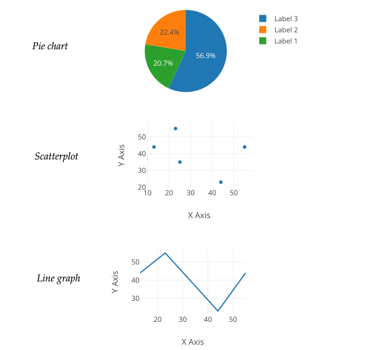
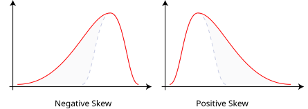
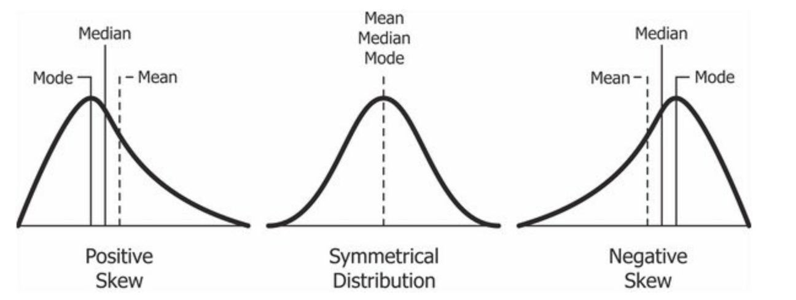
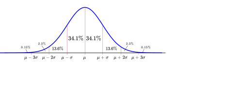

# GregMat Quant Mountain — Complete Revision Notes

Comprehensive, high-yield mathematical revision notes covering all fundamental definitions, rules, formulas, examples, and diagrammatic interpretations from **GregMat's Quant Mountain** (Groups 1–17).

---

## Table of Contents

1. [**Group 1 (Arithmetic)**](#group-1-arithmetic)
   - [1.1 Integers](#11-integers) • [1.2 Consecutive Integers](#12-consecutive-integers) • [1.3 The Number Line](#13-the-number-line) • [1.4 The 4 Arithmetic Operations](#14-the-4-arithmetic-operations) • [1.5 Exponents](#15-exponents) • [1.6 Roots](#16-roots) • [1.7 Factorials](#17-factorials) • [1.8 Operations with Negatives](#18-operations-with-negatives) • [1.9 PEMDAS](#19-pemdas) • [1.10 PEMDAS Trickiness](#110-pemdas-trickiness) • [1.11 # of Integers in an Interval](#111-of-integers-in-an-interval) • [1.12 Sum of Integers in an Interval](#112-sum-of-integers-in-an-interval) • [1.13 Factors / Divisors](#113-factors-divisors) • [1.14 Nifty Factor Finding System](#114-nifty-factor-finding-system) • [1.15 Greatest Common Factor (GCF)](#115-greatest-common-factor-gcf) • [1.16 Even and Odd Integers](#116-even-and-odd-integers) • [1.17 Consecutive Even/Odd Integers](#117-consecutive-evenodd-integers) • [1.18 Multiples](#118-multiples) • [1.19 Three Consecutive Integers](#119-three-consecutive-integers) • [1.20 Least Common Multiple (LCM)](#120-least-common-multiple-lcm) • [1.21 # of Multiples in an Interval](#121-of-multiples-in-an-interval) • [1.22 Sum of Multiples in an Interval](#122-sum-of-multiples-in-an-interval)
2. [**Group 2 (Arithmetic)**](#group-2-arithmetic)
   - [2.1 Divisibility Rules (1, 2, 3, 4)](#21-divisibility-rules-1-2-3-4) • [2.2 Divisibility Rules (5, 6, 8, 9, 10)](#22-divisibility-rules-5-6-8-9-10) • [2.3 Divisibility Rules (11)](#23-divisibility-rules-11) • [2.4 Prime Numbers](#24-prime-numbers) • [2.5 The Primes up to 50](#25-the-primes-up-to-50) • [2.6 Prime Factorization](#26-prime-factorization) • [2.7 Every Prime Factorization is Unique](#27-every-prime-factorization-is-unique) • [2.8 Determine Whether a # is Prime](#28-determine-whether-a-is-prime) • [2.9 Factors of Factorials](#29-factors-of-factorials) • [2.10 Non-Factors of Factorials](#210-non-factors-of-factorials) • [2.11 # of Numbers in Factorials](#211-of-numbers-in-factorials) • [2.12 # of Numbers in Factorials II](#212-of-numbers-in-factorials-ii) • [2.13 # of Numbers in Factorials III](#213-of-numbers-in-factorials-iii) • [2.14 Trailing Zeros](#214-trailing-zeros) • [2.15 Zero is Weird (Part 1)](#215-zero-is-weird-part-1) • [2.16 Zero is Weird (Part 2)](#216-zero-is-weird-part-2) • [2.17 Primes are Infinite](#217-primes-are-infinite) • [2.18 Positive Factors with PF](#218-positive-factors-with-pf) • [2.19 Odd Factors with PF](#219-odd-factors-with-pf) • [2.20 Even Factors with PF](#220-even-factors-with-pf) • [2.21 GCF with PF](#221-gcf-with-pf) • [2.22 LCM with PF](#222-lcm-with-pf) • [2.23 Exponent Unit Digit Patterns](#223-exponent-unit-digit-patterns)
3. [**Group 3 (Arithmetic)**](#group-3-arithmetic)
   - [3.1 Quotients](#31-quotients) • [3.2 Remainders](#32-remainders) • [3.3 Remainder When Denominator > Numerator](#33-remainder-when-denominator-numerator) • [3.4 Remainder with Negative Numbers](#34-remainder-with-negative-numbers) • [3.5 Remainder Patterns](#35-remainder-patterns) • [3.6 Remainders and Addition](#36-remainders-and-addition) • [3.7 Fractions](#37-fractions) • [3.8 Improper Fractions](#38-improper-fractions) • [3.9 Mixed Numbers and Improper Fractions](#39-mixed-numbers-and-improper-fractions) • [3.10 Adding and Subtracting Fractions](#310-adding-and-subtracting-fractions) • [3.11 Multiplying Fractions](#311-multiplying-fractions) • [3.12 Dividing Fractions](#312-dividing-fractions) • [3.13 Dividing by 1/Something](#313-dividing-by-1something) • [3.14 Rational versus Irrational I](#314-rational-versus-irrational-i) • [3.15 Decimals](#315-decimals) • [3.16 Writing as Powers of 10](#316-writing-as-powers-of-10) • [3.17 Other Number Systems Like Binary [optional]](#317-other-number-systems-like-binary-optional) • [3.18 Terminating versus Non-Terminating](#318-terminating-versus-non-terminating) • [3.19 Does It Terminate?](#319-does-it-terminate) • [3.20 Repeating versus Non-Repeating](#320-repeating-versus-non-repeating) • [3.21 Rational versus Irrational II](#321-rational-versus-irrational-ii) • [3.22 Converting Terminating Decimals to Fractions](#322-converting-terminating-decimals-to-fractions) • [3.23 Repeating Decimal to Fraction](#323-repeating-decimal-to-fraction) • [3.24 Rounding Decimals](#324-rounding-decimals) • [3.25 Exponent Rules I](#325-exponent-rules-i) • [3.26 Exponent Rules II](#326-exponent-rules-ii)
4. [**Group 4 (Arithmetic)**](#group-4-arithmetic)
   - [4.1 Roots as Exponents](#41-roots-as-exponents) • [4.2 Operation on Roots 1](#42-operation-on-roots-1) • [4.3 Operation on Roots 2](#43-operation-on-roots-2) • [4.4 "Pulling Out" Perfect Squares](#44-pulling-out-perfect-squares) • [4.5 Rationalizing Denominators](#45-rationalizing-denominators) • [4.6 Rationalising Denominators 2](#46-rationalising-denominators-2) • [4.7 The Number Line Revisited](#47-the-number-line-revisited) • [4.8 Real Number Properties 1](#48-real-number-properties-1) • [4.9 Real Number Properties 2](#49-real-number-properties-2) • [4.10 Real Number Properties 3](#410-real-number-properties-3) • [4.11 Real Number Properties 4](#411-real-number-properties-4) • [4.12 Absolute Value](#412-absolute-value) • [4.13 Representing Ratios](#413-representing-ratios) • [4.14 Proportions](#414-proportions) • [4.15 Cross Multiplication](#415-cross-multiplication) • [4.16 Percents](#416-percents) • [4.17 Percent Increase](#417-percent-increase) • [4.18 Percent Decrease](#418-percent-decrease) • [4.19 Quick Percent Calculations](#419-quick-percent-calculations) • [4.20 % greater than 100](#420-greater-than-100) • [4.21 % of vs % More](#421-of-vs-more) • [4.22 Fraction/Decimal/Ratio/Percent](#422-fractiondecimalratiopercent)
5. [**Group 5 (Algebra)**](#group-5-algebra)
   - [5.1 Algebraic Expressions](#51-algebraic-expressions) • [5.2 Polynomials](#52-polynomials) • [5.3 Polynomial Degree](#53-polynomial-degree) • [5.4 Linear and quadratic polynomials](#54-linear-and-quadratic-polynomials) • [5.5 Simplifying Expressions 1](#55-simplifying-expressions-1) • [5.6 Simplifying Expressions 2](#56-simplifying-expressions-2) • [5.7 Simplifying Expressions 3](#57-simplifying-expressions-3) • [5.8 Simplifying Expressions 4](#58-simplifying-expressions-4) • [5.9 Algebraic Identities](#59-algebraic-identities) • [5.10 Linear Equations](#510-linear-equations) • [5.11 Solving Linear Equations](#511-solving-linear-equations) • [5.12 Solving Absolute Value Equations](#512-solving-absolute-value-equations) • [5.13 System of Equations](#513-system-of-equations) • [5.14 Elimination Method](#514-elimination-method) • [5.15 Substitution Method](#515-substitution-method) • [5.16 System of Equations Possibilities](#516-system-of-equations-possibilities) • [5.17 The Quadratic Formula](#517-the-quadratic-formula) • [5.18 The Discriminant 1](#518-the-discriminant-1) • [5.19 The Discriminant 2](#519-the-discriminant-2) • [5.20 Factoring Quadratics](#520-factoring-quadratics) • [5.21 Completing the Square](#521-completing-the-square) • [5.22 Minimising/Maximising Quadratics](#522-minimisingmaximising-quadratics) • [5.23 Absolute Value Quadratics](#523-absolute-value-quadratics)
6. [**Group 6 (Algebra)**](#group-6-algebra)
   - [6.1 Inequalities](#61-inequalities) • [6.2 Solving Inequalities 1](#62-solving-inequalities-1) • [6.3 Solving Inequalities 2](#63-solving-inequalities-2) • [6.4 Solving Inequalities 3](#64-solving-inequalities-3) • [6.5 Solving Inequalities 4](#65-solving-inequalities-4) • [6.6 Functions](#66-functions) • [6.7 Domain of a function](#67-domain-of-a-function) • [6.8 Range of a function](#68-range-of-a-function) • [6.9 Even function](#69-even-function) • [6.10 Odd function](#610-odd-function) • [6.11 Words to Algebra 1](#611-words-to-algebra-1) • [6.12 Words to Algebra 2](#612-words-to-algebra-2) • [6.13 Simple Interest](#613-simple-interest) • [6.14 Compound Interest](#614-compound-interest) • [6.15 Mixture Problems](#615-mixture-problems) • [6.16 Distance Formula](#616-distance-formula) • [6.17 Relative Speed](#617-relative-speed) • [6.18 Work/Rate Problems](#618-workrate-problems) • [6.19 Sequences I](#619-sequences-i) • [6.20 Sequences II](#620-sequences-ii) • [6.21 Series I](#621-series-i) • [6.22 Series III](#622-series-iii)
7. [**Group 7 (Coordinate Geometry)**](#group-7-coordinate-geometry)
   - [7.1 The x-y Coordinate Plane](#71-the-x-y-coordinate-plane) • [7.2 Lines and Curves](#72-lines-and-curves) • [7.3 Reflections](#73-reflections) • [7.4 Symmetry across y-axis](#74-symmetry-across-y-axis) • [7.5 Symmetry across x-axis](#75-symmetry-across-x-axis) • [7.6 Symmetry about the origin](#76-symmetry-about-the-origin) • [7.7 Distance Between Two Points](#77-distance-between-two-points) • [7.8 Intercepts](#78-intercepts) • [7.9 Intercepts 2](#79-intercepts-2) • [7.10 Intercepts 3](#710-intercepts-3) • [7.11 Reflections Across Lines](#711-reflections-across-lines) • [7.12 Slope](#712-slope) • [7.13 Slope 2](#713-slope-2) • [7.14 Slope-Intercept form](#714-slope-intercept-form) • [7.15 Parallel Lines](#715-parallel-lines) • [7.16 Perpendicular Lines](#716-perpendicular-lines) • [7.17 System of Equations](#717-system-of-equations) • [7.18 Graphing Inequalities 1](#718-graphing-inequalities-1) • [7.19 Graphing Inequalities 2](#719-graphing-inequalities-2) • [7.20 Graphing Inequalities 3](#720-graphing-inequalities-3) • [7.21 Quadratic Equations](#721-quadratic-equations) • [7.22 Quadratic Equations 2](#722-quadratic-equations-2)
8. [**Group 8 (Coordinate Geometry)**](#group-8-coordinate-geometry)
   - [8.1 Graphing by CTS](#81-graphing-by-cts) • [8.2 Graphing by plotting](#82-graphing-by-plotting) • [8.3 Discriminant and the Plane](#83-discriminant-and-the-plane) • [8.4 Equation of a circle](#84-equation-of-a-circle) • [8.5 Circles and CTS](#85-circles-and-cts) • [8.6 Graphing Absolute Value Equations](#86-graphing-absolute-value-equations) • [8.7 Graphing Quadratic Absolute Value Equations](#87-graphing-quadratic-absolute-value-equations) • [8.8 Rotating 90 degrees](#88-rotating-90-degrees) • [8.9 Even functions](#89-even-functions) • [8.10 Odd functions](#810-odd-functions) • [8.11 Graph Shifting 1](#811-graph-shifting-1) • [8.12 Graph Shifting 2](#812-graph-shifting-2) • [8.13 Graph Shifting 3](#813-graph-shifting-3)
9. [**Group 9 (Geometry)**](#group-9-geometry)
   - [9.1 Lines](#91-lines) • [9.2 Types of Angles](#92-types-of-angles) • [9.3 Parallel Lines](#93-parallel-lines) • [9.4 Parallel Lines and Angles](#94-parallel-lines-and-angles) • [9.5 Polygons](#95-polygons) • [9.6 Degrees of a Triangle](#96-degrees-of-a-triangle) • [9.7 Sum of Interior Angles](#97-sum-of-interior-angles) • [9.8 Sum of Exterior Angles](#98-sum-of-exterior-angles) • [9.9 Angles of a Regular Polygon](#99-angles-of-a-regular-polygon) • [9.10 Types of Triangles](#910-types-of-triangles) • [9.11 Angle vs Side Length](#911-angle-vs-side-length) • [9.12 Triangle Inequality Theorem](#912-triangle-inequality-theorem) • [9.13 Area of a Triangle](#913-area-of-a-triangle) • [9.14 Triangle Congruency 1](#914-triangle-congruency-1) • [9.15 Triangle Congruency 2](#915-triangle-congruency-2) • [9.16 Triangle Congruency 3](#916-triangle-congruency-3) • [9.17 Pythagorean Theorem](#917-pythagorean-theorem)
10. [**Group 10 (Geometry)**](#group-10-geometry)
   - [10.1 Pythagorean Triplets](#101-pythagorean-triplets) • [10.2 30-60-90 Triangles](#102-30-60-90-triangles) • [10.3 45-45-90 Triangles](#103-45-45-90-triangles) • [10.4 Area of Equilateral Triangle](#104-area-of-equilateral-triangle) • [10.5 Similar Triangles](#105-similar-triangles) • [10.6 Quadrilaterals](#106-quadrilaterals) • [10.7 Types of Quadrilaterals 1](#107-types-of-quadrilaterals-1) • [10.8 Types of Quadrilaterals 2](#108-types-of-quadrilaterals-2) • [10.9 Parallelograms](#109-parallelograms) • [10.10 Isosceles Trapezoids](#1010-isosceles-trapezoids) • [10.11 Dividing Quadrilaterals 1](#1011-dividing-quadrilaterals-1) • [10.12 Dividing Quadrilaterals 2](#1012-dividing-quadrilaterals-2) • [10.13 Area of a Square](#1013-area-of-a-square) • [10.14 Area of a Rectangle](#1014-area-of-a-rectangle) • [10.15 Area of a Parallelogram](#1015-area-of-a-parallelogram) • [10.16 Area of a Trapezoid](#1016-area-of-a-trapezoid) • [10.17 Area of a Regular Hexagon](#1017-area-of-a-regular-hexagon) • [10.18 Area of a Regular Polygon](#1018-area-of-a-regular-polygon) • [10.19 Maximising Polygon Area](#1019-maximising-polygon-area) • [10.20 Maximum Area given a Perimeter](#1020-maximum-area-given-a-perimeter)
11. [**Group 11 (Geometry)**](#group-11-geometry)
   - [11.1 Circles 1](#111-circles-1) • [11.2 Circles 2](#112-circles-2) • [11.3 Pi](#113-pi) • [11.4 Approximating Pi](#114-approximating-pi) • [11.5 Central Angle Theorem](#115-central-angle-theorem) • [11.6 Circumference of a Circle](#116-circumference-of-a-circle) • [11.7 Length of an Arc](#117-length-of-an-arc) • [11.8 Area of a Circle](#118-area-of-a-circle) • [11.9 Area of a Sector](#119-area-of-a-sector) • [11.10 Tangent Lines](#1110-tangent-lines) • [11.11 Inscribed and Circumscribed Polygons](#1111-inscribed-and-circumscribed-polygons) • [11.12 Maximum Area Inside Circle](#1112-maximum-area-inside-circle) • [11.13 Concentric Circles](#1113-concentric-circles)
12. [**Group 12 (Geometry)**](#group-12-geometry)
   - [12.1 3D Figures 1](#121-3d-figures-1) • [12.2 3D Figures 2 (Optional)](#122-3d-figures-2-optional) • [12.3 Volume of a Cube](#123-volume-of-a-cube) • [12.4 Surface Area of a Cube](#124-surface-area-of-a-cube) • [12.5 Volume of Cuboid](#125-volume-of-cuboid) • [12.6 Surface Area of Cuboid](#126-surface-area-of-cuboid) • [12.7 Volume of Right Cylinder](#127-volume-of-right-cylinder) • [12.8 Surface Area of Right Cylinder](#128-surface-area-of-right-cylinder) • [12.9 Surface Area and Volume Relation](#129-surface-area-and-volume-relation) • [12.10 Diagonal of a Cube](#1210-diagonal-of-a-cube) • [12.11 Diagonal of a Cuboid](#1211-diagonal-of-a-cuboid) • [12.12 Volume of Stacked Cubes](#1212-volume-of-stacked-cubes) • [12.13 Surface Area of Stacked Cubes](#1213-surface-area-of-stacked-cubes)
13. [**Group 13 (Data Analysis)**](#group-13-data-analysis)
   - [13.1 Presenting Data 1](#131-presenting-data-1) • [13.2 Presenting Data 2](#132-presenting-data-2) • [13.3 Presenting Data 3](#133-presenting-data-3) • [13.4 Measures of Central Tendency](#134-measures-of-central-tendency) • [13.5 Mean](#135-mean) • [13.6 Median](#136-median) • [13.7 Mode](#137-mode) • [13.8 When Mean = Median](#138-when-mean-median) • [13.9 Weighted Mean](#139-weighted-mean) • [13.10 Measure of Position](#1310-measure-of-position) • [13.11 Quartiles](#1311-quartiles) • [13.12 Calculating Quartiles](#1312-calculating-quartiles) • [13.13 Percentiles](#1313-percentiles) • [13.14 Measures of Dispersion](#1314-measures-of-dispersion) • [13.15 Range](#1315-range) • [13.16 Interquartile Range](#1316-interquartile-range)
14. [**Group 14 (Data Analysis)**](#group-14-data-analysis)
   - [14.1 Boxplots](#141-boxplots) • [14.2 Standard Deviation](#142-standard-deviation) • [14.3 Calculating SD 1](#143-calculating-sd-1) • [14.4 Calculating SD 2](#144-calculating-sd-2) • [14.5 Population vs Sample SD](#145-population-vs-sample-sd) • [14.6 Changes to SD 1](#146-changes-to-sd-1) • [14.7 Changes to SD 2](#147-changes-to-sd-2) • [14.8 Standardisation](#148-standardisation) • [14.9 Sets](#149-sets) • [14.10 Lists](#1410-lists) • [14.11 Sets 2](#1411-sets-2) • [14.12 Intersections](#1412-intersections) • [14.13 Unions](#1413-unions) • [14.14 The Two Extremes](#1414-the-two-extremes) • [14.15 Inclusion-Exclusion Formula](#1415-inclusion-exclusion-formula) • [14.16 Three Overlapping Sets](#1416-three-overlapping-sets)
15. [**Group 15 (Data Analysis)**](#group-15-data-analysis)
   - [15.1 The "Choice" Method](#151-the-choice-method) • [15.2 Permutations vs Combinations 1](#152-permutations-vs-combinations-1) • [15.3 Permutations vs Combinations 2](#153-permutations-vs-combinations-2) • [15.4 Permutation Notation](#154-permutation-notation) • [15.5 Combination Notation](#155-combination-notation) • [15.6 Permutations with Restrictions](#156-permutations-with-restrictions) • [15.7 Sitting Together](#157-sitting-together) • [15.8 Subtracting Out](#158-subtracting-out) • [15.9 Permutations with Repeats](#159-permutations-with-repeats) • [15.10 Permutations in a Circle](#1510-permutations-in-a-circle) • [15.11 Combinatorics Pattern](#1511-combinatorics-pattern) • [15.12 Multiple Groups](#1512-multiple-groups) • [15.13 Converting to Letters/Words](#1513-converting-to-letterswords) • [15.14 Yes or No?](#1514-yes-or-no)
16. [**Group 16 (Data Analysis)**](#group-16-data-analysis)
   - [16.1 Introduction to Probability](#161-introduction-to-probability) • [16.2 Probability as Area](#162-probability-as-area) • [16.3 Probability of NOT](#163-probability-of-not) • [16.4 Independent Events](#164-independent-events) • [16.5 Mutually Exclusive Events](#165-mutually-exclusive-events) • [16.6 Probability and Venn Diagrams](#166-probability-and-venn-diagrams) • [16.7 A and B (Indepedent)](#167-a-and-b-indepedent) • [16.8 A and B (Mutually Exclusive)](#168-a-and-b-mutually-exclusive) • [16.9 A or B (Independent)](#169-a-or-b-independent) • [16.10 A or B (Mutually Exclusive)](#1610-a-or-b-mutually-exclusive) • [16.11 Extremes of Probability](#1611-extremes-of-probability) • [16.12 Probability and Combinatorics](#1612-probability-and-combinatorics) • [16.13 Conditional Probability](#1613-conditional-probability) • [16.14 Expected Value](#1614-expected-value) • [16.15 Least/Most](#1615-leastmost)
17. [**Group 17 (Data Analysis)**](#group-17-data-analysis)
   - [17.1 Random Variable](#171-random-variable) • [17.2 Relative Frequency](#172-relative-frequency) • [17.3 Probability Density Table](#173-probability-density-table) • [17.4 Mean of a Random Variable](#174-mean-of-a-random-variable) • [17.5 Uniform Distribution](#175-uniform-distribution) • [17.6 Skewness](#176-skewness) • [17.7 Skewness and the Mean](#177-skewness-and-the-mean) • [17.8 Normal Distribution 1](#178-normal-distribution-1) • [17.9 Normal Distribution 2](#179-normal-distribution-2)

---

# Group 1 (Arithmetic)

### 1.1 Integers

On the most basic level, the natural numbers are the "counting numbers." For example:

$$1, 2, 3, 4, 5, 6...$$

The whole numbers are very similar but the number $0$ is added:

$$0, 1, 2, 3, 4, 5, 6...$$

The **<u>integers</u>** are the whole numbers with one important addition. The negative counterparts are included:

$$...-6, -5, -4, -3, -2, -1, 0, 1, 2, 3, 4, 5, 6...$$

---

### 1.2 Consecutive Integers

The difference between the two integers is $1$. For example, $6$ and $7$ are consecutive integers, and so would $2$,$3$ and $4$.

---

### 1.3 The Number Line

The **number line** is something humans invented to more easily see the relationship between numbers. As one moves from left to right, much like how many cultures around the world read their languages, the numbers get larger. For example, if you look below, you'll see that the value of $x$ is to the left of the value of $y$. That indicates that $x$ is less than $y$. You'll also notice that $-3$ is to the left of $-2$, again indicating that $-3$ is less than $-2$.

Image: [Wikipedia](https://en.wikipedia.org/wiki/Number_line)

- **Key Properties of the Real Number Line:**
  - Numbers increase strictly from left to right: for any two points $x$ and $y$, $x < y \iff x$ lies to the left of $y$.
  - Negative numbers decrease in value as their magnitude increases (e.g., $-3 < -2$ because $-3$ lies to the left of $-2$).
  - The distance between any two numbers $a$ and $b$ on the number line is given by $|a - b|$.

---

### 1.4 The 4 Arithmetic Operations

There are four **Arithmetic Operations**. You probably remember learning them in grade school:

- Addition
  - For example, $2 + 3 = 5$

- Subtraction
  - For example, $5 - 3 = 2$

- Multiplication
  - For example, $2 \times 3 = 6$
  - Can also be written as $(2)(3)$ or $2 \cdot 3$

- Division
  - For example $6 / 2 = 3$
  - Can also be written as $6 \div 2$ or $\frac{6}{2}$

---

### 1.5 Exponents

Beyond the four arithmetic operations mentioned earlier, there are other operations you need to know about.

**Exponents**

- Other Names
  - "powers"
  - "raising a number to a certain power"
  - "squaring" when a number is multiplied by itself once ($2 \times 2$)
  - "cubing" when a number is multiplied by itself twice ($2 \times 2 \times 2$)

We use exponents, or "powers," as a shorthand for multiplication.

Long way $= 5 \times 5 \times 5 \times 5 \times 5 \times 5$

Short way $= 5^6$

---

### 1.6 Roots

Beyond the four arithmetic operations mentioned earlier, there are other operations you need to know about.

**Roots**

- Other Names
  - We don't say "find the second root" of something. We say "take the square root."
  - We don't say "find the third root" of something. We say "take the cube root."
  - For everything else, we simply say $4$th root, $5$th root, etc.

So what are roots? Essentially they are the REVERSE of exponents. They undo the exponent process. See the examples below:

$4^2=16$ and $\sqrt{16}=4$

$3^3=27$ and $\sqrt[3]{27}=3$

$-3^3=-27$ and $\sqrt[3]{-27}=-3$

**Several Important Points**

1. "Even" roots, like the square root, the $4$th root, the $6$th root, etc. can ONLY take positive values or zero. No negatives allowed. $\sqrt{-25}$ makes no dang sense.
2. "Odd" roots, like the cube root, the $5$th root, the $7$th root, etc. can take positive OR negative values (or zero). Everything is allowed. $\sqrt[3]{27}$ and $\sqrt[3]{-27}$ both make sense.
3. If $n^2=64$, then $n$ equals BOTH $8$ and $-8$.
4. However, if we take $\sqrt{64}$, the result is ONLY $8$. (You might have been taught differently in your school. This is how ETS likes to do it.)

---

### 1.7 Factorials

**Factorials**, denoted by an exclamation point (!) at the end of an integer, are a very specific operation that essentially means "multiply every integer together down to $1$." For example:

$$10!=10 \times 9 \times 8 \times 7 \times 6 \times 5 \times 4 \times 3 \times 2 \times 1$$

And of course, $6!$ equals...

$$6! = 6 \times 5 \times 4 \times 3 \times 2 \times 1$$

**Memorize These Values (Recommended)**

$$0!=1$$

$$1!=1$$

$$2!=2$$

$$3!=6$$

$$4!=24$$

$$5!=120$$

$$6!=720$$

The cool thing about these numbers is how quickly they balloon in size. For example, the number of ways to arrange a deck of cards is $52!$. This number is so stupidly large that if you were to go shuffle a deck of cards right now (go do it, seriously), you would have created an arrangement of cards that HAS NEVER OCCURRED BEFORE IN THE UNIVERSE. **mINd**bLoWn.

---

### 1.8 Operations with Negatives

**Adding a Negative Number to another Number**

This is like subtraction. For example...

$$6 + (-4) = 6 - 4 = 2$$

**NOTE:**A negative number added to another negative is always negative.

**Subtracting a Negative Number from another Number**

This is like addition. For example...

$$6 - (-4) = 6 + 4 = 10$$

**Note:** a negative subtracted from a negative can result in either a negative number, zero, or a positive number.

**Multiplying Negative Numbers**

If you multiply a positive number and a negative number together, the result is negative. If you multiply two negative numbers together, the result is positive. Shit makes no sense but that's the way it goes.

$$-5 \times 4=-20$$

$$-10 \times -3=30$$

$$6 - (-4) = 6 + 4 = 10$$

**Dividing Negative Numbers**

This is very similar to multiplication. A negative and a positive equal a negative. Two negatives equal a positive.

$$-10 \div 2=-5$$

$$-15 \div -3=5$$

---

### 1.9 PEMDAS

PEMDAS, or BOMDAS, is way to remember the **Order of Operations**.

- **P**arenthesis (brackets)
- **E**xponents
- **M**ultiplication
- **D**ivision
- **A**ddition
- **S**ubtraction

---

### 1.10 PEMDAS Trickiness

In PEMDAS, it's easy to conclude that addition is before subtraction and mulitiplication is before division. But this is not strictly true. It's better to consider them as "on the same level." Whenever you encounter multiplication/division and addition/subtraction, you work from left to right.

For example, in $6 \div 2 \times 3$, if you strictly follow PEMDAS, you would do multiplication first with the $2 \times 3$ to get $6$. You would then do $6 \div 6$ to get $1$.

But if you go from left to right (as you should), you would do $6 \div 2$ first to get $3$ and then you would do $3 \times 3$ to get $9$.

---

### 1.11 # of Integers in an Interval

To find the number of integers in an interval, simply use the formula below:

*Last Number*$-$ *First Number* $+1$

For example, to find the number of integers from $27$ to $84$, inclusive...

$$84-27+1=58$$

**NOTE**: The word "inclusive" means you include the $27$ and $84$ in the range and the word "exclusive" means you don't. If you see the word exclusive, you would instead do:

$$83-28+1=56$$

---

### 1.12 Sum of Integers in an Interval

You can approach this problem in a several ways:

Sum of integers from $1$ to $n$

Whenever the interval starts with $1$, it's pretty simple. You just need to use the formula below. For example, to find the sum of the integers from $1$ to $80$, inclusive...

$$\frac{n(n+1)}{2}=\frac{80 \times 81}{2}=3240$$

Sum of integers from $n$ to $m$, where $n \neq 1$

For this one, you can follow these steps. For example, what is the sum of all integers from $30$ to $101$:

1. Find the number of intergers in the interval: $101 - 30 +1 = 72$
2. Calculate the sum of the first and last number: $30+101=131$.
3. Multiply the numbers from steps 1 and 2 together and divide by $2$ (see below):

$$\frac{72 \times 131}{2}=4716$$

If you're wondering why this works, I suggest checking out the video again in the study plan.

---

### 1.13 Factors / Divisors

If an integer is divisible by a certain number, then that certain number is a **factor** of that integer. For example, the integer $36$ is divisible by, in no particular order, $4$, $1$, $9$, $-6$, etc. All of those numbers are factors of $36$. Notice that negative integers can also be factors, but the GRE usually asks only about positive factors.

Another way to think about factors is, "What numbers multiply together to form an integer." For example, $5 \times 20=100$, so $5$ and $20$ are factors of $100$.

---

### 1.14 Nifty Factor Finding System

If an integer is not unreasonably large, the **Nifty Factor-Finding System** (patent pending) is a great way to list out all of the integer's positive factors. For example, let's say we want to find all of the positive factors of $60$.  You start by saying $1 \times 60 =60$ and make the gap between the two multiplied numbers smaller and smaller until you find all of them (see below):

$$1 \times 60$$

$$2 \times 30$$

$$3 \times 20$$

$$4 \times 15$$

$$5 \times 12$$

$$6 \times 10$$

And we found all of them! Pretty nifty.

---

### 1.15 Greatest Common Factor (GCF)

The **Greatest Common Factor** (GCF) of two numbers is the largest factor common to both numbers. For example, if we list out all of the positive factors of $12$ and $18$, we will see that $6$ is the GCF:

**$12$**: $1$, $2$, $3$, $4$, $6$, $12$

**$18$**: $1$, $2$, $3$, $6$, $9$, $18$

When the two numbers are not unreasonably large, we can simply list out all of the positive factors of each to identify the GCF. When the numbers are large, however, we have to use a different trick to find the GFC. That'll come later in your studies.

---

### 1.16 Even and Odd Integers

- Even numbers are integers with $2$ as a factor. Example: $44$.
- Odd numbers are integers that are not even. Example: $43$.

---

### 1.17 Consecutive Even/Odd Integers

Consecutive even numbers:

$$2,4,6,8,10...$$

Consecutive odd numbers:

$$1,3,5,7,9,...$$

---

### 1.18 Multiples

If $n$ is an integer, the numbers $0n$, $1n$, $2n$, $3n$, $4n$ and so on are **multiples** of $n$.

For example, multiples of $70$ include $0$, $70$, $140$, $210$, $280$ and so on. Multiples can also be negative, but GRE does not test this concept. At least we've never seen them do so.

---

### 1.19 Three Consecutive Integers

Example: $$4,5,6$$

- A multiple of $3$ is **always** included amongst the three integers,
- the product of the three integers is always a multiple of $3$, and
- the sum of the three integers is also a multiple of $3$

---

### 1.20 Least Common Multiple (LCM)

The **Least Common Multiple** (LCM) of two numbers is the smallest **<u>positive</u>** multiple they share in common. We have to specifically identify "positive" multiple here because of course $0$ is a multiple of every integer.

For example, if we list out all of the positive multiples of $12$ and $18$, we will see that $36$ is the LCM:

**$12$**: $12$, $24$, $36$, $48$

**$18$**: $18$, $36$, $54$, $72$

When the two numbers are not unreasonably large, we can simply list out all of the positive multiples of each to identify the LCM. When the numbers are large, however, we have to use a different trick to find the LCM. That'll come later in your studies.

---

### 1.21 # of Multiples in an Interval

There are two cases to consider when finding the **# of Multiples in an Interval**:

Case 1 (From $1$ to $n$)

This is the easy case. You simply have to divide $n$ by the multiple in question and take the whole number result. For example, how many multiples of $31$ are there from $1$ to $1$,$000$?

$$\frac{1000}{31} \approx 32.26$$

We simply take the whole number $32$ to get our answer.

Case 2 (From $n$ to $m$, where $n \neq 1$)

For this case, we want to use the following formula:

$$\frac{\textrm{last multiple} - \textrm{first multiple}}{\textrm{multiple in question}} + 1$$

For example, the number of multiples of $3$ from $29$ to $112$ is

$$\frac{111 - 30}{3} + 1 = 28$$

---

### 1.22 Sum of Multiples in an Interval

The best way to illustrate how to find the **Sum of Multiples in an Interval** is with an example. Imagine we want to find the sum of all multiples of $3$ from $1$ to $500$. Follow these steps:

- **Step 1**: Find the number of multiples of $3$ from $1$ to $500$.
  - $\frac{500}{3}$, take the whole number result, to get 166. Put this number aside for now.

- **Step 2**: List out the first three multiples and last three multiples in the interval.
  - $3$, $6$, $9$...$492$, $495$, $498$

- **Step 3**: Notice that every "pair" in that list above adds up to $501$.
  - $3+498=501$
  - $6+495=501$
  - $9+492=501$

- **Step 4**: We know that every "pair" in the list adds up to $501$. We also know that we have a total of $166$ multiples of $3$ (from step 1), giving us $83$ pairs ($\frac{166}{2}$).  We can then find the total sum by multiplying these two numbers together (see below):

$$\frac{166}{2} \times 501 = 41,583$$

Pretty frickin' cool if I must say so myself.

**NOTE:**This trick still works even if you find an odd number of multiples in an interval. For example, there are $9$ multiples of $3$ from $1$ to $28$ and each pair adds up to $30$. To find the sum of all multiples, see below:

$$\frac{9}{2} \times 30=135$$

---

# Group 2 (Arithmetic)

### 2.1 Divisibility Rules (1, 2, 3, 4)

- All integers are divisible by $1$.
- An integer is divisible by $2$ if it is even -- if it ends in $0$, $2$, $4$, $6$, or $8$.
- An integer is divisible by $3$ if the sum of the digits in that integer is also divisible by $3$.
  - For example, $816$ is divisible by $3$ because $8+1+6=15$, a number divisible by $3$.

- An integer is divisible by $4$ if the last two digits in that integer are also divisible by $4$.
  - For example $56$,$234$,$332$ is divisible by $4$ because $32$ is divisible by $4$.
  - Note that if the last two digits are $00$, the entire number is divisible by $4$ because $00$ is divisible by $4$.

---

### 2.2 Divisibility Rules (5, 6, 8, 9, 10)

- An integer is divisible by $5$ if the last digit in the number is a $5$ or a $0$.
- An integer is divisible by $6$ if it is also divisible by $2$ and $3$.
  - Another way to think about this is all even numbers that are divisible by $3$ are also divisible by $6$.

- An integer is divisible by $8$ if the last three digits of the number are divisible by $8$.
  - Note that if the number ends in $000$, it is divisible by $8$.

- An integer is divisible by $9$ if the sum of the digits of the number is divisible by $9$.
  - For example, $5$,$985$ is divisible by $9$ because the sum of the digits is $27$, a multiple of $9$.

- An integer is divisible by $10$ if the last digit in the number is $0$.

For $11$, watch the associated video; it's not part of a mountain entry.

---

### 2.3 Divisibility Rules (11)

Starting with a + from the left-most digit, assign + and - to adjacent digits of the number. Then add the +s and -vs separately, and subtract the sum of the -vs from the sum of the +vs. If the result is a multiple of $11$, the number is divisible by $11$.

For example, consider the number $638$. We assign + to $6$ and $8$, and $-$ to $3$. The sum of the +s is $14$, while the sum of the -s is $3$. (sum of +s) - (sum of -s) = 14 - 3 = 11, which is divisible by $11$. Hence $638$ is divisible by $11$.

Or use the calculator.

---

### 2.4 Prime Numbers

Numbers with **exactly** two factors - $1$ and the number itself.

Example: $5$ and $11$ are prime numbers.

---

### 2.5 The Primes up to 50

Primes are of course the "building blocks" of numbers in that every positive integer greater than $1$ can be "broken down to its prime factors" via prime factorization.

And of course primes only have two positive factors: $1$ and itself.

We recommend memorizing **<u>all</u>** primes from $1$ to $50$. There are $15$ of them.

$$2, 3, 5, 7, 11, 13, 17, 19, 23, 29, 31, 37, 41, 43, 47$$

---

### 2.6 Prime Factorization

Every positive integer can be written as the product of primes in exactly one way.

For example, $24$ can be written as $2^3 \times 3$.

---

### 2.7 Every Prime Factorization is Unique

No two distinct integers share the same prime factorization. It's sort of like the DNA of the number.

---

### 2.8 Determine Whether a # is Prime

To determine whether the integer $n$ is prime, take the square root of $n$ and see if it is divisible by any prime numbers lower than that square root value. For example, if we wanted to determine whether $107$ is prime, we would do the following:

$$\sqrt{107} \approx 10.34$$

Next, we have to see if $107$ is divisible by the primes below that value: $2$, $3$, $5$, and $7$. If it's not divisble by any of those smaller primes, then we could conclude that $107$ is indeed prime. $107$ is indeed prime by the way.

---

### 2.9 Factors of Factorials

Factorials have a *lot* of factors!

For example, $8!$ has the obvious factors of $8$, $7$, $6$, $5$, $4$, $3$, $2$, and $1$, but it has so many more!

$56$ is also a factor of $8!$ because $8 \times 7 = 56$.

$30$ is also a factor of $8!$ because $6 \times 5 = 30$.

Even $1$,$440$ is a factor of $8!$ because $8 \times 6 \times 5 \times 3 \times 2 = 1$,$440$.

In fact, if you convert $8!$ into its prime factorization form, $2^7 \times 3^2 \times 5^1 \times 7^1$, and you do the prime factorization trick to find the number of positive factors, you will see that $8!$ has $96$ positive factors. If you're not sure where this came from, don't worry -- it's coming later in your studies.

$20!$ has a mind-numblingly large $41$,$040$ positive factors!

---

### 2.10 Non-Factors of Factorials

As stated previously, factorials have A LOT of factors. So how do we find values that are NOT factors of a factorial? Let's say for example we're trying to find the smallest integers that are not factors of $20!$.

- **Step 1**: Simply find the prime numbers greater than $20$.

$23, 29, 31, 37, 41$, etc. are all NOT factors of $20!$

- **Step 2**: But what if we want to find the non-prime non-factors? In this case, you simply need to find the multiples (greater than the number itself) of our previously identified primes:

$23$: $46, 69, 92...$

$29$: $58, 87, 116...$

You get the idea. **NOTE** that this trick really only works for factorials greater than or equal to $10!$. If it's a small factorial, you're better off finding the factors using a more brute-force, list them all out approach.

---

### 2.11 # of Numbers in Factorials

To find the maximum **# of Numbers in a Factorial**, best to look at an example.

$$\frac{100!}{3^x}=\textrm{integer}$$

This question is saying that $100!$ is divisible by $3^x$, where $x$ is an integer. So what would be the maximum value of $x$? In other words, how many powers of $3$ are there in $100!$?

**Here's the Trick**

- Step 1: How many multiples of $3^1$ are there from $1$ to $100$? **$33$**
- Step 2: How many multiples of $3^2$ ($9$) are there from $1$ to $100$? **$11$**
- Step 3: How many multiples of $3^3$ ($27$) are there from $1$ to $100$? **$3$**
- Step 4: How many multiples of $3^4$ ($81$) are there from $1$ to $100$? **$1$**
- Step 5: How many multiples of $3^5$ ($243$) are there from $1$ to $100$? **$0$**
  - Once we hit $0$, we stop.

Simply add those numbers together to find the number of powers of $3$ in $100!$:

$$33 + 11 + 3 + 1 = 48$$

**WARNING:**The trick below only works if you're dividing by a prime number power. See the next entry/video for why.

---

### 2.12 # of Numbers in Factorials II

**But what if we're not dividing by a prime number?**

##### *Part 1*

For example, what if the question asks us to find the powers of $15$ in $200!$?

$$\frac{200!}{15^x}$$

We cannot simply use the trick we learned previously because $15$ is not a prime number. Thus, we need to rewrite the problem like so:

$$\frac{200!}{(3 \times 5)^x} = \frac{200!}{3^x5^x}$$

So now we're dealing with prime numbers. But the question is do we focus on the $3$ or the $5$? Well, to make one $15$, we need one $3$ and one $5$. Which is more common? In $200!$, are we going to find more powers of $3$ or more powers of $5$? We're going to find more powers of $3$. That means that...

$5 = $ limiting factor

So really this problem is asking us to focus solely on the powers of $5$ given that they are fewer in number than the powers of $3$. To find the number of powers of $15$ in $200!$, we simply find the number of powers of $5$ in $200!$.

$$\frac{200}{5^x}$$

*Continuously divide by $5$ and take the whole number result*

$$40...8...1...0$$

$$40+8+1=49$$

##### *Part 2*

For example, what if the question asks us to find the powers of $4$ in $200!$?

$$\frac{200!}{4^x}$$

Now, you might be tempted to follow the process you've learned earlier ...

- There are $50$ 4s in $200$
- There are $12$ 16s in $200$
- There are $3$ 64s in $200$

... and conclude that the maximum integer value of $x$ such that $4^x$ divides $200!$ is $63$.

The problem is that we're off. Quite a bit off actually. The reason is that this method does not work when we're working with non-prime numbers. The good news is that we can easily reduce this problem into primes:

$$\frac{200!}{4^x} \rightarrow \frac{200!}{2^{2x}}$$

Why does this help? Because $2$ is a prime, we can use our existing method for finding powers in $n!$:

- There are $100$ 2s in $200$
- There are $50$ 4s in $200$
- There are $25$ 8s in $200$
- There are $12$ 16s in $200$
- There are $6$ 32s in $200$
- There are $3$ 64s in $200$
- There is $1$ 128s in $200$

This gives us a total of $197$ powers of 2 in $200!$. But we're looking for powers of 4, not 2. Given that $4^x = 2^{2x}$, and $2^{197}$ divides $200!$, we just need to divide by $2$ (and take the integer part) to answer the problem: $2^{197} = 4^{197/2} = 4^{98}$ (not $98.5$ as $x$ needs to be an integer). Hence the largest integer value of $x$ is $98$.

---

### 2.13 # of Numbers in Factorials III

#### The "shortcut"

Let's go back to the initial problem of finding $x$ such that $\frac{100!}{3^x}$ is an integer.

Once you find the number of multiples of $3^1$ from $1$ to $100$, continue dividing that result by $3$ and taking the whole number result until you get to zero.

*Continuously divide by $3$ and take the whole number result*

$$33...11...3...1...0$$

$$33+11+3+1=48$$

Here's another example. How many powers of $5$ are there in $2000!$?

*Continuously divide by $5$ and take the whole number result*

$$400...80...16...3...0$$

$$400+80+16+3=499$$

> This is called [Legendre's theorem](https://en.wikipedia.org/wiki/Legendre%27s_formula). You're not expected to know the specific name of the theorem for the GRE.

#### Bringing it all together

What if we're to find the largest integer $x$ such that the below is an integer?

$$\frac{100!}{24^x}$$

Notice that this problem combines two concepts covered earlier:

- Splitting $24^x$: $24^x = 8^x \times 3^x$
- Decomposing $8^x$ into powers of primes: $8^x = 2^{3x}$

As a result,

$$\frac{100!}{24^x} = \frac{100!}{2^{3x} 3^x}$$

Now the problem is to determine the limiting factor: is it the 2 or the 3? Using the concepts covered earlier, we find that

- $2^{97}$ divides $100!$
- $3^{48}$ divides $100!$

From this, it may *look* like the limiting factor is the 3, because $48 < 97$. Recall however that we actually have $2^{3x}$ (because of the $8^x$), so the maximum value of $x$ is instead the integer part of $97 \div 3 = 32$. As a result, the limiting factor is actually $2$, because $32 < 48$. Hence the answer is $32$, with $32$ being the largest power of $24$ that divides the factorial of $100$.

---

### 2.14 Trailing Zeros

**What are Trailing Zeros?**

Trailing zeros are the consecutive $0$s at the end of an integer. For example, $10$ has one trailing zero, $100$ has two, and $1$,$000$,$000$ has $6$.

Notice the following pattern:

$$10^1=10$$

$$10^2=100$$

$$10^3=1,000$$

$$10^4=10,000$$

The number of trailing zeros depends entirely on the number of powers of $10$ in our integer. If we have one power of $10$, we have one trailing zero. If we have eight powers of $10$, we have $8$ trailing zeros.

**Let's Look at an Example**

How many trailing zeros are there in $270!$? In other words, how many powers of $10$ are there in $270!$?

$$\frac{270!}{10^x}$$

To apply our "trick," we have to break $10$ down into the primes $2 \times 5$, and we know that $5$s are less common than $2$s, so $5$s are our limiting factor. So rewrite the problem as and then apply our trick (learned previously)...

$$\frac{270!}{5^x}$$

*Continuously divide by $5$ and take the whole number result*

$$54...10...2...0 = 66$$

So $270!$ has $66$ zeros at the end. You can see the [number here](https://gregmatapi.s3.amazonaws.com/media/misc/files/270_factorial_trailing_zeros.PNG) in all its glory if you'd like to confirm.

---

### 2.15 Zero is Weird (Part 1)

Zero is a weird beast.

- It is neither positive nor negative.
- It is even (because it's divisible by $2$).
- It is a multiple of EVERY integer.
- It's a factor only of itself.

---

### 2.16 Zero is Weird (Part 2)

Zero continues to be a weird beast.

- If you try to divide by $0$, you'll get an undefined result. It literally doesn't work.
  - $5 \div 0=$ undefined

- Anything raised to the power of $0$ equals $1$.
  - $5^0 = 1$
  - (The one exception) $0^0 =$ undefined.

- $0! = 1$
  - That's odd, innit?

---

### 2.17 Primes are Infinite

There are infinitely many primes, though the number of primes within a fixed interval tend to decrease as the numbers get larger. For example, you can see how the number of primes decreases in each interval.

$$1-100: 25$$

$$101-200: 21$$

$$201-300: 16$$

So if the primes keep decresaing, how do we know they're infinite? You can show this through Proof by Contradiction. Imagine that the primes are finite. The only primes we have are $2$, $3$, and $5$. You then create an integer using these primes and adding $1$:

$$2 \times 3 \times 5 + 1 = 31$$

Notice that, by adding $1$, we created a new number that **<u>cannot</u>** share any of the prime factors of the number $1$ below ($30$). And in so doing we found a new prime: $31$.

So then we add $31$ to our list of "finite" primes: $2$, $3$, $5$, $31$. We then repeat the process:

$$2 \times 3 \times 5 \times 31 + 1 = 931$$

Now, $931$ is NOT prime, but its prime factors are completely different than the prime factors of the number below ($930$). With $931$, we have found TWO new primes not on our list: $7$ and $19$.

This process can be repeated forever. By adding $1$, you'll create a new number that always gives us more primes. Pretty frickin' cool! Euclid figured this shit out over 2,000 years ago. Dude was on another level.

---

### 2.18 Positive Factors with PF

To find the number of positive factors for a given integer using Prime Factorization, follow these steps:

- first prime factorize the integer (eg: $3000 = 2^3 \times 3^1 \times 5^3$)
- add 1 to each exponent in the prime factorization (in this case, we would get $4$, $2$, $4$)
- multiply those numbers together (in this case $4 \times 2 \times 4 = 32$)

Here's another example. How many positive factors does $36$,$000$ have?

- Prime factorize: $2^53^25^3$
- Add $1$ to each exponent: $(5+1), (2+1), (3+1)=6,3,4$
- Multiply those numbes together:
  - $6 \times 3 \times 4=72$

If a certain integer has **<u>only</u>**<u>**one**</u> prime factor, like $7^5$, simply add $1$ to the exponent $5+1=6$ to get the total number of positive factors.

---

### 2.19 Odd Factors with PF

To find the number of **Odd Positive Factors with Prime Factorization** for an integer greater than $1$, following these steps. For example, how many odd positive factors does $30$,$184$ have?

- First prime factorize the integer
  - $30$,$184=2^37^311^1$

- Focus only on the odd prime divisors (ignore the $2$ and its exponent)
  - $7^311^1$

- Apply the prime factorization trick to find the number of positive odd factors
  - $(3+1)(1+1)=8$

---

### 2.20 Even Factors with PF

There are two ways to do this.

Way 1

Find the total number of positive factors and subtract the number of odd positive factors.

# of positive factors $-$ # of odd factors $=$ # of even factors

- **Example**: How many even positive factors does $1$,$500$ have?
  - Prime Factorization: $=2^23^15^3$
  - # of positive factors: $3 \times 2 \times 4 = 24$
  - # of positive odd factors: $2 \times 4 = 8$
  - # of positive even factors: $24 -8=16$

Way 2

First prime factorize the number in question. Add $1$ to the exponent of every odd prime divisor, but **<u>do nothing</u>** to the exponent on the $2$. Multiply those numbers together.

- **Example**: How many even positive factors does $1$,$500$ have?
  - Prime Factorization: $=2^23^15^3$
  - add $1$ to exponent of each odd prime divisor: $(1+1), (3+1) = 2, 4$
  - Do nothing to the exponent on the $2$: it remains $2$
  - Multiply those numbers together: $2 \times 2 \times 4 = 16$

---

### 2.21 GCF with PF

To find the **Greatest Common Factor with Prime Factorization**, follow these steps. For example, what is the greatest common factor of $60$ and $150$?

- Prime factorize both numbers
  - $60 = 2^23^15^1$
  - $150 = 2^13^15^2$

- Identify the prime divisors the two numbers share in common. Make sure to note the exponents they share in common too.
  - $60$ and $150$ share one $2$, one $3$, and one $5$.

- Multiply together what they share in common.
  - $2 \times 3 \times 5 = 30$

---

### 2.22 LCM with PF

To find the **Least Common Multiple with Prime Factorization**, follow these steps. For example, what is the least common multiple of $110$ and $200$?

- First, prime factorize both numbers.
  - $110=2^15^111^1$
  - $200=2^35^2$

- Next, across both numbers, write down all of the prime divisors represented.
  - $2^a5^b11^c$

- Finally, find the largest exponent present for each prime divisor. For this example, $a = 3$, $b=2$, and $c=1$. Write down these exponents and multiply the number out.
  - $2^35^211^1=2200$

---

### 2.23 Exponent Unit Digit Patterns

Sometimes you're asked to find the unit digit of $n^x$, where $x$ is so large that if you tried to put it into your calculator, it would explode. Thus, you should memorize or be able to figure out the **Exponent Unit Digit Patterns**.

- $0^n$: always $0$
- $1^n$: always $1$
- $2^n$: $2, 4, 8, 6$, $2,4,8,6$ and so on
  - repeats in blocks of $4$

- $3^n$: $3, 9, 7, 1$, $3,9,7,1$ and so on
  - repeats in blocks of $4$

- $4^n$: $4, 6$, $4, 6$, $4, 6$ and so on
  - repeats in blocks of $2$

- $5^n$: always $5$
- $6^n$: always $6$
- $7^n$: $7, 9, 3, 1$, $7, 9, 3, 1$ and so on
  - repeats in blocks of $4$

- $8^n$: $8, 4, 2, 6$, $8, 4, 2, 6$ and so on
  - repeats in blocks of $4$

- $9^n$: $9, 1$, $9, 1$, $9, 1$ and so on
  - repeats in blocks of $2$

---

# Group 3 (Arithmetic)

### 3.1 Quotients

To put it simply, the **Quotient** is the whole number of times one number goes into another number. For example, $8 \div 4$ has a quotient of $2$ because $4$ "goes into" $8$ two whole times.

**Some More Examples**

- $23 \div 5$
  - Quotient $=4$

- $\frac{39}{20}$
  - Quotient $=1$

- $-15 \div 9$
  - Quotient $=-2$
  - This one is a little weird. The reason why it's $-2$ is because $-2 \times 9 = -18$, and $-18 < -15$. When you multiply the divisor by the quotient, the result has to either be less than or equal the number being divided.

---

### 3.2 Remainders

When you divide a number by another number, the **Remainder** is colloquially known as what's "left over" or what's "remaining." For example, $10 \div 2$ results in a quotient of $5$ and a remainder of $0$. Nothing is "left over" in this case because the quotient times the divisor equals the number being divided.

$$2 \times 5 = 10$$

However, $17 \div 7$ gives us a non-zero remainder. The quotient is $2$ because $2 \times 7 =14$. What's "left over" int his case? What do we need to add to $14$ to get to $17$? That's the remainder. In this case, it's $3$.

$2$ (quotient) $\times \ 7 + 3$ (remainder) $= 17$

**Important**: Remainders can never be negative. They're either zero or positive integers.

---

### 3.3 Remainder When Denominator > Numerator

Whenever the **Number Being Divided is Less than the Divisor**, and both integers are positive, the remainder is simply the number being divided. For example...

$$5 \div 6$$

In this case, the remainder is $5$. This is because...

$0$ (quotient) $\times \ 6 + 5$ (remainder) $=5$.

---

### 3.4 Remainder with Negative Numbers

**What if the number being divided is negative?**

For example, what if we're doing this: $-29 \div 7$?

Mistake: $-4$ (quotient) $\times \ 7 + -1$ (remainder) $= -29$

Correct: $-5$ (quotient) $\times \ 7 + 6$ (remainder) $= -29$

The reason why the first way is wrong is because it results in a negative remainder. Remember that's not allowed.

---

### 3.5 Remainder Patterns

For an integer $x$, try writing the first powers of $x$ and see if the remainders repeat when dividing that power with a certain integer.

For example, the first four positive powers of $7$ repeat in a $2$-$4$-$3$-$1$ pattern when divided by $5$.

---

### 3.6 Remainders and Addition

To find the overall remainder in a **Remainders and Addition** problem, find the remainder of each term separately and then add them together. For example, what is the remainder of the following problem below:

$$\frac{17+9}{5}$$

This remainder is equal to the remainder of each term added together:

$$\frac{17}{5} + \frac{9}{5} = 2 \ (remainder) + 4 \ (remainder) = 6$$

If the resulting remainder sum is less than $5$ in this case, say $0$, $1$, $2$, $3$, or $4$, then that's simply the remainder because all of those values are less than $5$. If however, the remainder sum is equal to or greater than the divisor, then the final remainder is equal to the remainder sum minus $5$:

$$6-5=1 = \ final \ remainder$$

Of course you wouldn't solve this problem this way because it's so obvious that $(17+9) \div 5$ has a remainder of $1$, but you could use this trick in a problem like the one below that asks you to find the remainder:

$$\frac{7^{30}+6^{45}}{3}$$

---

### 3.7 Fractions

**Fractions**are numbers that adhere to a particular form. There is one integer on top, called the numerator, one integer on the bottom, called the denominator, and a line in the middle.

$$\frac{a}{b} = \frac{integer}{integer} = \frac{numerator}{denominator}$$

Of course the denominator can **<u>never</u>** be $0$.

A Couple of Notes

1. Integers like $27$ or $5!$ are fractions because they can simply be written as $\frac{27}{1}$ and $\frac{5!}{1}$.
2. A number like $\frac{\sqrt{2}}{3}$ is **<u>not</u>** a fraction because the numerator is not an integer.
3. Fractions can be <u>**SIMPLIFIED**</u>. For example...

$$\frac{18}{24} = \frac{9}{12} = \frac{3}{4}$$

This "reduction" process stops when the numerator and denominator share no common factors.

---

### 3.8 Improper Fractions

Fractions of the form

$$\frac{a}{b}$$

where $a > b$ and $b \neq 0$ are called improper fractions.

---

### 3.9 Mixed Numbers and Improper Fractions

A **Mixed Number** (also called Mixed Fraction) occurs when you combine an integer and a fraction, where the numerator is less than the denominator. There's an example below:

$$5 \frac{2}{3}$$

An **Improper Fraction** is a fraction where the numerator is greater than the denominator. There's an example below:

$$\frac{39}{17}$$

Converting Back and Forth

To convert a mixed number to an improper fraction, follow these steps:

- Multiply the integer and the denominator together.
- Add the numerator to that product from step 1. This result is the new numerator.
- Put the new numerator over the old denominator.

$$3 \frac{5}{7} = \frac{3 \times 7 + 5}{7} = \frac{26}{7}$$

---

### 3.10 Adding and Subtracting Fractions

To **Add Fractions**, follow these steps:

- Check to see if the denominator of each fraction is the same. If so, adding fractions is easy. Simply add the numerators and keep the same denominator.

$$\frac{3}{7} + \frac{2}{7} = \frac{5}{7}$$

- However, if the two (or more) denominators are not the same, you have to make them the same by finding the Least Common Multiple of the denominators. See the example below:

$$\frac{5}{8} + \frac{1}{12} = \left(\frac{3}{3} \right)\left(\frac{5}{8}\right) + \left(\frac{2}{2} \right)\left(\frac{1}{12}\right) = \frac{15}{24} + \frac{2}{24} = \frac{17}{24}$$

You follow the exact same process for **Subtracting Fractions**, except this time there is a minus sign in the middle and you have to subtract the numerators to the right from the numerator on the left.

---

### 3.11 Multiplying Fractions

**Multiplying Fractions** is easy as pie. Simply multiply the numerators together and multiply the denominators together.

$$\frac{3}{11} \times \frac{5}{9} = \frac{3 \times 5}{11 \times 9} = \frac{15}{99}$$

You can then of course Simplify the Fraction...

$$\frac{15}{99} = \frac{3 \times 5}{3 \times 33} = \frac{5}{33}$$

---

### 3.12 Dividing Fractions

**Dividing Fractions** is not as easy as Multiplying Fractions, but it's pretty close. Follow these steps:

- Flip the numerator and denominator of any fractions that are not the first one.
- Multiply all the fractions together.

Example 1

$$\frac{5}{11} \div \frac{7}{12} = \frac{5}{11} \times \frac{12}{7} = \frac{60}{77}$$

Example 2

$$\frac{1}{2} \div \frac{5}{4} \div \frac{2}{3} = \frac{1}{2} \times \frac{4}{5} \times \frac{3}{2} = \frac{12}{20} = \frac{3}{5}$$

---

### 3.13 Dividing by 1/Something

Whenever you **Divide by $\frac{1}{something}$**, that is the same as multiplying the number by that "something." For example, if we were to divide $6$ by $\frac{1}{5}$, that would be equivalent to...

$$6 \div \frac{1}{5}=6 \times 5 = 30$$

This is just a nifty shoftcut to allow you to move more quickly when solving problems.

---

### 3.14 Rational versus Irrational I

**Rational numbers** are numbers that can be written as a fraction.

**Irrational numbers** are numbers that **<u>cannot</u>** be written as a fraction. Remember, something like $\frac{\pi}{3}$ is not a fraction because the numerator in this case is not an integer.

Where do these terms come from?

Another way to say fraction is of course "ratio." So rational numbers are ones that can be written as a "ratio." Irrational numbers are ones that cannot be written as a "ratio". Get it? Pretty cool!

---

### 3.15 Decimals

**Decimals** - more accurately the **Decimal Number System** - was an **<u>amazing</u>** invention, for several reasons.

- It is a positional number system, meaning that the location of a digit in a number influences its value.
  - For example, in the numbers $30$ and $300$, the $3$ represents different values. In the first, it is $3 \times 10^1$ and in the second it is $3 \times 10^2$
  - Before the invention of positional number systems, you had to keep adding characters to represent larger numbers. For example, this is the number $3$,$888$ in Roman numerals:
    - MMMDCCCLXXXVIII

- It uses only $10$ characters to express an infinite number of numbers:
  - $0$, $1$, $2$, $3$, $4$, $5$, $6$, $7$, $8$, $9$

- It is a "base-10" number system. This is intuitive to humans, likely because we have ten fingers.
  - There are other "base" systems, like binary ($2$ characters), hexadecimal ($16$ characters), vigesimal ($20$ characters), and sexagesimal ($60$ characters).
  - It's true that other "base" systems have fewer characters, but they wouldn't be as intuitive (remember our $10$ fingers).

- It uses the digit $0$ to indicate "there is nothing in this place." This is an incredibly useful invention.
  - For example, in the number $405.02$, the $0$s tell us there is nothing in the tens place or tenths place.

---

#### If you're from Europe or Latin America

Chances are that you reverse the comma and the dot. For example, instead of 3,456.78 such students will write 3.456,78 (in a few cases, the thousands separator is replaced by a space, so 3 456,78).

You cannot do this on the GRE, irrespective of where you take the test. Don't worry too much though - the GRE ignores commas entirely (i.e, you cannot use a thousands separator) so you should be able to find out if you've made a mistake.

---

### 3.16 Writing as Powers of 10

Because the Decimal Number System uses a base of $10$, you can **Write Any Number with Powers of $10$**.

**Example**

$$789.91 = (7 \times 10^2) + (8 \times 10^1) + (9 \times 10^0)$$ $$+ (9 \times 10^{-1}) + (1 \times 10^{-2})$$

Pretty cool!

---

### 3.17 Other Number Systems Like Binary [optional]

Other systems include binary (base 2, i.e, numbers are represented only in terms of $0$ and $1$), and hexadecimal (base 16, i.e numbers are represented in terms of 0123456789ABCDEF).

---

### 3.18 Terminating versus Non-Terminating

A fraction, when converted to a decimal, will do one of two things:

- Terminate (red means stop)
  - The decimals stop at some point.

- Not Terminate (green means go)
  - The decimals go on forever, like the crazy fools they are.

Examples (Terminating)

$$\frac{1}{2}=0.5$$

$$\frac{5}{16}=0.3125$$

Examples (Non-Terminating)

$$\frac{1}{3}=0.3333...$$

$$\frac{2}{7}=0.285714...$$

It's Not Just Fractions

Irrational numbers are also non-terminating. Take any irrational number and its decimals will go on forever. Look at the two examples below:

$$\pi = 3.141592653589...$$

$$\sqrt{2}=1.414213562373...$$

---

### 3.19 Does It Terminate?

You might ask yourself the following question: **Does the fraction terminate**? To answer that question, follow these steps:

- Simplify the fraction to its simplest form so that there are no shared factors among the numerator and denominator.
- If there are only powers of $2$ in the denominator, it definitely terminates.
- If there are only powers of $5$ in the denominator, it definitely terminates.
- If there is a combination of only powers of $2$ and $5$ in the denominator, it definitely terminates.

Example

$$\frac{n}{2^45^7}$$

If $n$ is an integer -- any integer -- then the fraction above will **<u>always</u>** terminate. Test it out with some various integers.

---

### 3.20 Repeating versus Non-Repeating

A Non-Terminating Decimal (see previous entry in the quant mountain), will do one of two things:

- Repeat in some endless pattern
  - We call these Repeating Decimals

- Go on endlessly with no pattern at all
  - We call these Non-Repeating Decimals

Repeating Decimals are **<u>always</u>** from fractions, where the numerator and denominator are both integers. Here are two examples below:

$$\frac{4}{9} = 0.444444...$$

$$\frac{5}{11} = 0.45454545...$$

The first endlessly repeats the digit $4$ and the second endlessly repeats the digits $45$.

Non-Repeating Decimals are always irrational numbers and never fractions. Here are two examples below:

$$e = 2.718281828459...$$

$$\sqrt{3} = 1.732050807569$$

Is There a Shortcut to Write Repeating Decimals?

Why yes! I'm so glad you asked. Instead of writing $\frac{1}{3}$ as $0.3333333333333...$, we can simply write it with a little line over the repeating part. Take a look at the examples below:

$$\frac{1}{3} = 0.\overline3$$

$$\frac{23}{99} = 0.\overline{23}$$

$$\frac{3}{7} = 0.\overline{428571}$$

---

### 3.21 Rational versus Irrational II

Now that we've discussed non-terminating, non-repeating decimals, we can introduce the **Second Definition of Irrational Numbers**:

- First Definition: Any number that cannot be represented as a fraction.
  - Recall that $\frac{\pi}{2}$ is **<u>not</u>** a fraction.

- Second Definition: Any number that, when written as a decimal, is non-terminating and non-repeating.
  - For example, $\sqrt{6} = 2.449489742...$
  - Notice how there is no pattern there.

Wanna Hear Some Crazy Shit?

When irrational numbers are written in decimal form, the digits after the decimal point go on forever, infinitely, in no pattern at all. This means that, if you look long enough, you can find <u>**any**</u> sequence of numbers you wish. Looking for the number $9$,$876$,$543$,$210$? It's in there! Looking for every phone number that you've ever had written in back-to-back form? It's in there! Looking for every integer from $1$ to $10$ billion, in order? It's in there!

Frickin' mind boggling, I'm telling you.

---

### 3.22 Converting Terminating Decimals to Fractions

Just write it as a fraction with the denominator a power of $10$, and simplify.

For example:

$$0.125 = \frac{125}{1000} = \frac{1}{8}$$

---

### 3.23 Repeating Decimal to Fraction

To **Convert a Repeating Decimal to a Fraction**, simply follow these steps:

- Note the number of digits in the repeating pattern. Does only one digit repeat? Two? Three?
- If only one digit repeats, put it over $9$.
- If two digits repeat, put them over $99$.
- If three digits repeat, put them over $999$.
- You get the idea...

Examples

$$0.\overline5 = \frac{5}{9}$$

$$0.\overline{29} = \frac{29}{99}$$

$$0.\overline{712} = \frac{712}{999}$$

What is this Sorcery?

To see why this works, see if you can follow the steps below:

$$x = 0.\overline{43}$$

$100x = 43.\overline{43}$                                   *Multiply both sides by*$100$*.*

$99x = 43$                                   *Subtract*$x=0.\overline{43}$*from both sides.*

$x = \frac{43}{99}$                                   *Divide both sides by*$99$.

---

### 3.24 Rounding Decimals

Some decimals go on forever, either in a repeating or non-repeating fashion. Some decimals terminate but there are still a fair number of digits after the decimal point. In both of these cases, we might want to **Round the Decimals**, essentially "cut them off." No more soup for you!

Rounding a decimal provides a convenient approximation of the number in question. Here's how you do it:

- Determine which place after the decimal point you want to be the "last one."
  - Is it the tenths place? The hundredths? The thousandths?

- Look to the right of that digit in that place. Note the number.
- If the number to the right is either $0$, $1$, $2$, $3$, or $4$, simply discard every digit to the right of the place that you want to the "last one."
- If the number to the right is either $5$, $6$, $7$, $8$, or $9$, add $1$ to the digit that is in the place you want to be the "last one" and discard everything to the right.
- Sometimes if the digit in the "last place" is a $9$, there is a domino effect that influences other digits to the left. See examples three and four below.

Examples

Let's say we're rounding to the thousandths place.

$$\frac{1}{3} = 0.\overline3 = 0.333333... \approx 0.333$$

$$3.57885 \approx 3.579$$

$$0.569773 \approx 0.570$$

$$5.999999 \approx 6.000$$

---

### 3.25 Exponent Rules I

There are numerous **Exponent Rules** we have to memorize. *Some of the rules below will be discussed in the next PrepSwift video - don't worry about the ordering too much.*

- Rule 1: If $a^n = a^m$, then $n=m$. Tthis works if $a$ doesn't equal $0$ or $1$.

$$5^x = 5^{y+2}$$

$$x = y+2$$

- Rule 2: If you have a negative exponent, you can make it positive by "flipping" the fraction.

$$5^{-3} = \frac{1}{5^3}$$

$$\frac{2}{3^{-3}} \rightarrow 2 \times \frac{1}{3^{-3}} \rightarrow 2 \times 3^3$$

- Rule 3: If you multiply two numbers together with the same base, you can add the exponents.

$$a^n \times a^m = a^{n+m}$$

$$3^5 \times 3^7 = 3^{12}$$

- Rule 4: If you divide a number by another number with the same base, you can subtract the exponents.

$$\frac{a^n}{a^m} = a^{n-m}$$

$$\frac{7^7}{7^3} = 7^4$$

- Rule 5: If you raise anything to the $0$ power, it equals $1$, except in the $0^0$ case, which is undefined.

$$874^0 = 1$$

---

### 3.26 Exponent Rules II

There are numerous **Exponent Rules** we have to memorize. *Some of the rules below were dicussed in the previous PrepSwift video - don't worry about the ordering too much.*

- Rule 6: If you multiply two different numbers together with the same exponent, you can do the following:

$$5^3 \times 3^3 = (5 \cdot 3)^3$$

$$(2 \cdot 9)^4 = 2^4 \cdot 9^4$$

- Rule 7: If you divide two different numbers with the same exponent, you can do the following:

$$ \left(\frac{a}{b}\right)^m = \frac{a^m}{b^m}$$

$$ \left(\frac{7}{3}\right)^2 = \frac{7^2}{3^2}$$

- Rule 8: If you raise a number with an exponent to another exponent (with parentheses included), you simply multiply the exponents.

$$(a^m)^n = a^{mn}$$

$$(2^5)^7 = 2^{35}$$

Danger!!

$$5^{3^3} \neq 5^9$$

$$(5^3)^3 = 5^9$$

$$5^{3^3} = 5^{27}$$

---

# Group 4 (Arithmetic)

### 4.1 Roots as Exponents

You know what's pretty cool? **Roots Can be Written as Exponents**.

Examples

$$\sqrt{5} = 5^{\frac{1}{2}}$$

$$\sqrt[3]{5} = 5^{\frac{1}{3}}$$

$$\sqrt[4]{5} = 5^{\frac{1}{4}}$$

---

### 4.2 Operation on Roots 1

- $$\sqrt{a^2} = |a|$$

If $a \gt 0$:

- $$(\sqrt{a})^2 = a$$

If $a \gt 0$ and $b \gt 0$:

- $$\sqrt{a} \times \sqrt{b} = \sqrt{ab}$$

---

### 4.3 Operation on Roots 2

- If $a, b > 0$, $$\frac{\sqrt{a}}{\sqrt{b}} = \sqrt{\frac{a}{b}}$$
- If $n$ is a positive even integer, $$\sqrt[n]{a^n} = |a|$$
- If $n$ is an odd positive integer, $$\sqrt[n]{a^n} = a$$

---

### 4.4 "Pulling Out" Perfect Squares

Roots can be simplified by taking out all the perfect squares (or cubes, or the $n$th power, depending on the question) under the root after prime factorising what's inside the root. For example,

$$\sqrt{360}$$

$$=\sqrt{2^3 \times 3^2 \times 5^1}$$

Now take the perfect squares:

$$\sqrt{(2^2 \times 3^2) \times (2 \times 5)}$$

$$=2 \times 3 \times \sqrt{10}$$

$$=6 \sqrt{10}$$

---

### 4.5 Rationalizing Denominators

For some reason, it **<u>really</u>** bothers mathematicians when there is a radical in the denominator of a fraction. To get rid of it, we need to **Rationalize the Denominator**.

- If there is a single radical in the denominator of a fraction, multiply both the numerator and denominator by that radical. This will have the effect of removing the radical from the denominator.

$$\frac{2}{\sqrt{3}} \times \frac{\sqrt{3}}{\sqrt{3}} = \frac{2\sqrt{3}}{3}$$

Notice how we're <u>**not changing**</u> the fraction's value here because we're essentially multiplying it by $1$.

- If there is a radical and something else in the denominator of the fraction, multiply both the numerator and the denominator by its conjugate -- basically its "opposite." See the example below:

$$\frac{3}{\sqrt{3}+2} \times \frac{\sqrt{3}-2}{\sqrt{3}-2} = \frac{3\sqrt{3}-6}{3-4}= \frac{3\sqrt{3}-6}{-1}$$

---

### 4.6 Rationalising Denominators 2

Fractions of the form

$$\frac{a}{b + \sqrt{c}}$$

can be simplified by multiplying both sides by $b - \sqrt{c}$, thereby getting rid of the square root on the denominator:

$$\frac{a}{b + \sqrt{c}} \times \frac{b - \sqrt{c}}{b - \sqrt{c}} = \frac{a(b - \sqrt{c})}{b^2 - c}$$

---

### 4.7 The Number Line Revisited

Let's **Revisit the Number Line**. In our previous entry regarding the number line, we made it seem as if only integers we're on there. That's not exactly true. The real number line comprises **<u>all</u>** real numbers, even irrational ones. Even though we cannot nail down $\sqrt{2}$'s decimals exactly, it **<u>does</u>**have a position on the real number line. All irrational (and rational) numbers do**.**

---

### 4.8 Real Number Properties 1

Whenever you're completing operations on real numbers, we need to keep in mind several **Real Number Properties**:

- Property 1: Adding number $a$ to number $b$ is the same thing as adding number $b$ to number $a$.

$$a+b=b+a$$

- Property 2: Brackets have no impact when we are just multiplying or adding: $$3 + (4 + 5) = (3 + 4) + 5 = 3 + 4 + 5$$ $$3 \times (4 \times 5) = (3 \times 4) \times 5 = 3 \times 4 \times 5$$
- Property 3: The distributive law: $$a (b + c) = a \times b + a \times c$$
- Property 4: $0$ added to a number returns the number itself, and $0$ multiplied by a number returns $0$.

---

### 4.9 Real Number Properties 2

Whenever you're completing operations on real numbers, we need to keep in mind several **Real Number Properties**:

- Property 5: If the product of two numbers is $0$, either (or both) of the numbers must be $0$: $$ab = 0 \rightarrow a = 0 \textrm{ or/and } b = 0$$
- Property 6: Dividing any number by $0$ is not defined.
- Property 7: The sum and product of two positive numbers is positive.
- Property 8: The sum and product of two negative numbers is negative and positive respectively.

---

### 4.10 Real Number Properties 3

Whenever you're completing operations on real numbers, we need to keep in mind several **Real Number Properties**:

- Property 9: If the product of two numbers is negative, exactly one of the two numbers is negative.
- Property 10: The absolute value of the sum of two integers is always less than or equal to the sum of the absolute values of the two integers. That is, $$|a + b| \leq |a| + |b|$$
- Property 11: The absolute value of the product of two integers is equal to the product of the absolute values of the two integers. That is, $$|ab| = |a||b|$$
- Property 12: If $a = 1$, $$a = a^2 = \sqrt{a}$$ while if $a > 1$, $$a^2 > a > \sqrt{a}$$ and if $0< a < 1$, $$\sqrt{a} > a > a^2$$

---

### 4.11 Real Number Properties 4

- If $a > 0$ and $b < 0$, $ab < 0$
- $$|a + b| \leq |a| + |b|$$
- $$|a| \times |b| = |ab|$$
- If $a > 1$, $a^2 > a$
- If $0 < a < 1$, $a^2 < a$

---

### 4.12 Absolute Value

There are two ways to think about **Absolute Value**, the casual way and the "correct" way. The casual way is easier to understand.

- Casual Definition: The absolute value is a machine that "makes whatever is inside it positive."

$$|-5|=5$$

$$|-3-5|=|-8|=8$$

- The "Correct" Definition: The absolute value of something is its "distance from $0$" on the number line. For example...

$$|n|=5$$

This is basically asking us what values of $n$ are a distance of $5$ away from $0$? Well that would be $5$ and $-5$ of course. That's why $n$ takes on two values here.

**Don't forget** that the absolue value of something **<u>can</u>** equal zero but **<u>never</u>** a negative value.

---

### 4.13 Representing Ratios

- $$a:b$$
- $$\frac{a}{b}$$
- $a$ to $b$

all represent the same thing - the ratio of $a$ to $b$.

---

### 4.14 Proportions

A **Proportion** is an equation involving two fractions, or two ratios. Basically, it's just two fractions equal to each other. For example...

$$\frac{a}{b} = \frac{c}{d}$$

$$\frac{3}{5}=\frac{21}{35}$$

---

### 4.15 Cross Multiplication

If you're dealing with a proportion, you can use **Cross Multiplication** either to prove that the two fractions equal each other or solve for some unknown value. The way it works is you multiply the numerator of the fraction on the left by the denominator of the fraction on the right. You then set that equal to the product of the numerator on the right and denominator on the left. In essence, the two products "cross" each other.

Proving Two Fractions Equal Each Other

$$\frac{5}{8}=\frac{15}{24}$$

$$5\times24=8\times15$$

$$120=120$$

Solving For An Unknown Value

$$\frac{a}{9}=\frac{5}{3}$$

$$3a=5\times9$$

$$a=15$$

---

### 4.16 Percents

A **Percent** is simply a fraction, or ratio, meaning "parts per $100$". For example, $37\%$ is simply $37$ parts per $100$, or $0.37$. Here's another example:

$$25\%=\frac{25}{100}$$

This of course can be simplified to...

$$25\%=\frac{1}{4}$$

---

### 4.17 Percent Increase

Imagine that someone has $12$ marbles yesterday and $18$ marbles today. What was the **Percent Increase** in the number of marbles this person had from yesterday to today? You can use the formula below:

$$\frac{|\textrm{difference}|}{\textrm{smaller number}}$$

$$\frac{18-12}{12} = \frac{6}{12} = 50\%$$

Note that the percent increase can never be negative. That's why there is an absolute value in the numerator of the equation.

---

### 4.18 Percent Decrease

Imagine that someone has $20$ marbles yesterday and $16$ marbles today. What was the **Percent Decrease** in the number of marbles this person had from yesterday to today? You can use the formula below:

$$\frac{|\textrm{difference}|}{\textrm{larger number}}$$

$$\frac{20-16}{20}= \frac{4}{20} = 20\%$$

---

### 4.19 Quick Percent Calculations

- $30\%$ more than $a$ = $1.3a$
- $30\%$ less than $a$ = $0.7a$

---

### 4.20 % greater than 100

$$\frac{\textrm{larger number}}{\textrm{smaller number}}$$

For example, $30$ is $200\%$ of $15$

---

### 4.21 % of vs % More

- $b$ is $200\%$ of $a$ means that $b = 2a$
- However, $b$ is $200\%$ **more** than $a$ means that $b = 3a$

---

### 4.22 Fraction/Decimal/Ratio/Percent

Get this ya'll. **Fractions, decimals, percents, and ratios** are literally the same thing. They can all be used to represent the same value.

Example 1

$\frac{1}{2}=0.5=50\%=1$:$2$

Example 2

$\frac{12}{5}=2.4=240\%=12$:$5$

---

# Group 5 (Algebra)

### 5.1 Algebraic Expressions

Algebraic Expressions are generally just equations, but without the $=$ sign. It's like they didn't want to commit to a full relationship!

Some examples would be:

- $4x$
- $2x+3$ — note that all the pieces do not need to have a variable (sometimes numbers just want to hang out with letters).
- $7y + 2y$
- $y^3-y$ — note that the variable $y$ can be raised to powers (power to the $y$!).
- $x+y-z$ — note that we can mix variables (a regular math party).
- $3x^5+48m^2-37z^{-2}$ — even this horrendous expression is valid! (It's the math equivalent of a chaotic family reunion).

Algebraic expressions might look like a random assortment of numbers and letters, but they have their own kind of order. Just think of them as the free-spirited artists of the math world, creating without the constraints of an equals sign.

---

### 5.2 Polynomials

Sum of a finite number of terms in which each term is either a constant or a product of a coefficient and one or more variables with non-negative integer exponents.

Example: $4x^2 + 7x + 1$ is a polynomial in one variable, namely $x$.

---

### 5.3 Polynomial Degree

The degree of a polynomial is the highest power of the variable in the polynomial. Think of it as the head honcho, the top dog, the main event.

You can assign a degree to both a single term and an entire polynomial expression:

- **Degree of a Term:** The sum of the exponents of the variables in that term:
  - Example: $6x^2y^3$ has a degree of $2 + 3 = 5$.

- **Degree of a Polynomial (Expression):** The highest degree of any term in the polynomial:
  - Example: $5x^4 + 2x^2y - 7xy^2 + 4$ has a degree of $4$ because the first term has a degree of $4$, while the remaining terms have degrees of $3$, $3$, and $0$.

Some other notes:

- A constant has a degree of $0$ - For example, you can re-write $8$ as $8x^0$ (remember that variables raised to the power of $0$ would be $1$)

- You sum up the exponents, even if they come from different variables - In the case of $x^2y^2 + x^3$ , the degree is actually $4$, not $3$.

So, keep an eye on those exponents—they’re the ones running the show!

---

### 5.4 Linear and quadratic polynomials

- Polynomial with degree $1$ = linear
- Polynomial with degree $2$ = quadratic

---

### 5.5 Simplifying Expressions 1

Combining like terms:

$$6x^3 + 2xy + 2x^3 - xy$$

$$=(6x^3 + 2x^3) + (2xy - xy)$$

$$=8x^3 + xy$$

---

### 5.6 Simplifying Expressions 2

FOIL = **F**ront, **O**utside, **I**nside, **L**ast

Example:

$$(x + 4)(2x - 5)$$

$$=2x^2 - 5x + 8x - 20$$

---

### 5.7 Simplifying Expressions 3

Factoring out. For example,

$$6x^3 + 9x$$

$$=3x \times 2x^2 + 3x \times 3$$

$$=3x(2x^2 + 3)$$

---

### 5.8 Simplifying Expressions 4

Factoring and cancelling. For example:

$$\frac{7x^2 + 14x}{2x + 4}$$

$$=\frac{7x(x + 2)}{2(x + 2)}$$

$$=\frac{7x}{2}$$

This is where $x \neq -2$ - watch out for this as while $x = -2$ works in the simplified expression - it does not in the **original** expression. Hence $x = -2$ is not a valid solution.

---

### 5.9 Algebraic Identities

The benevolent "algebraicians" have kindly bestowed upon us some slick shortcuts, known as "identities."

Identity 1: **$ax + bx = x(a + b)$**

- $3x + 5x = x(3 + 5) = 8x$
- Factoring out the common factor is like gathering all the x’s into one party.

Identity 2: **$ax - bx = x(a - b)$**

- $4x - 2x = x(4 - 2) = 2x$
- Same party trick, but with a bit of subtraction drama.

Identity 3: **$(a + b)^2 = a^2 + 2ab + b^2$**

- $(x + 3)^2 = x^2 + 2(x)(3) + 3^2 = x^2 + 6x + 9$
- The square of a binomial: turning a sum into a squared spectacle.

Identity 4: **$(a - b)^2 = a^2 - 2ab + b^2$**

1. $(x - 4)^2 = x^2 - 2(x)(4) + 4^2 = x^2 - 8x + 16$
2. The square of a difference: because subtraction deserves some flair too.

Identity 5: **$(a + b)(a - b) = a^2 - b^2$**

- $(x + 5)(x - 5) = x^2 - 5^2 = x^2 - 25$
- The difference of squares: when opposites attract and then subtract.

These identities are your algebraic cheat codes, learn them well and use them wisely!

---

### 5.10 Linear Equations

A Linear Equation is an algebraic equation in which several conditions are satisfied:

- One or more variables is present
- Each variable is raised to the first power
- Constant terms are allowed
- Coefficients are allowed
- The degree of every term is $1$ (so $xy = 4$ won't work for example).

**Examples**

$$x=5$$

$$y=3x+7$$

$$x+y+8z = 732$$

---

### 5.11 Solving Linear Equations

Solving a Linear Equation means to find the value of the variable (or variables) that make the equation true. To accomplish such a feat, we are often "isolating" the variable. Note the example below:

$$8x+13x = 42$$

Notice how the $x$ variable is not isolated. It's not by itself. We have to apply our equation rules in order to get that dang $x$ by itself.

- **Step 1:**Combine like terms.
  - $21x=42$

- **Step 2**: Divide both sides by $21$.
  - $x=2$

We did it! Notice how $x$ is now by itself. We can confidently say that $x=2$.

**NOTE:**Some equations are NOT solvable or have infinite solutions. Take for example $x+y=10$. There are an infinite number of $(x,y)$ pairs that make that equation true.

---

### 5.12 Solving Absolute Value Equations

Set up two equations, one for when the expression inside the absolute value is positive, and one when it is not.

Example: to solve $|3x + 6| = 21$, we have

- $3x + 6 = 21$ when $3x + 6 \geq 0$
- $-(3x + 6) = 21$ when $3x + 6 \leq 0$

---

### 5.13 System of Equations

When you have two more equations, each containing two or more variables, you have Systems of Equations.

- **Example 1 (a set of two equations, each with two variables)**

$$3x-5y=28$$

$$7x+10y=-5$$

- **Example 2 (a set of three equations, each with three variables)**

$$3x-5y+4z=28$$

$$7x+10y-z=-5$$

$$-4x+y+z=19$$

**NOTE:**Systems of equations are solvable if the number of variables in total equals the number of equations in the set. For example, to solve a system of four equations, the four equations must have the four variables in some way (it's not necessary that all four variables be present in each equation). And the equations cannot be equivalent or inconsistent (for example, $x + y = 2$ and $2x + 2y = 4$ are the same thing, while $2x + 2y = 5$ would be inconsistent as it's impossible for the two statements to be true at the same time). It is also worth remembering that you can add or subtract the two equations (so if you have $x + y = 2$ and $x - 2y = 5$, you can add both equations to get $2x - y = 7$).

If you know linear algebra (not covered on the GRE), an equivalent statement is to show that the matrix is not singular (i.e, the determinant is not $0$). For example, for example 2, the corresponding matrix is $\begin{pmatrix} 3 & -5 & 4 \\ 7 & 10 & -1 \\ -4 & 1 & 1  \end{pmatrix}$. The determinant of this matrix is $236$, which is not $0$, so there'll be an unique solution for this system. As a reminder, you are not expected to know this for the GRE.

---

### 5.14 Elimination Method

In the Elimination Method, you manipulate one or both of the equations so that, when you add one equation to the other or subtract one equation from the other, one of the variables is eliminated, allowing you to solve the system of equations.

Example 1 (adding the equations to eliminate a variable)

$$3x+2y=7$$

$$5x-y=9.5$$

Multiply both sides of the second equation by $2$ to get the following:$10x-2y=19$. The equations now look this:

$$3x+2y=7$$

$$10x-2y=19$$

If you add the two equations together, you get $13x=26$, which means $x=2$. If $x=2$, $y$ must equal $0.5$.

Example 2 (subtract the second equation from the first to eliminate a variable)

$$4x+5y=11$$

$$x+y=5$$

Multiply both sides of the second equation by $4$ to get the following: $4x+4y=20$. The equations now look like this:

$$4x+5y=11$$

$$4x+4y=20$$

If you subtract the second equation from the first, you get $y=-9$. If $y=-9$, $x$ must equal $14$.

---

### 5.15 Substitution Method

Isolate one variable in one equation and plug it in the other equation to solve.

---

### 5.16 System of Equations Possibilities

- The system has one solution - i.e, only one pair of variables satisfy the equations
- The system has infinite solutions - i.e, there are infinite pairs of the variables that would satisfy the equations
- The system has no solution - i.e, there are no pairs of variables that would satisfy the equations

---

### 5.17 The Quadratic Formula

The Quadratic Formula is a pain in the ass to use, but it **<u>always</u>** works. It never fails. And it works for every quadratic. The solutions of

$$ax^2 + bx + c = 0$$

are

$$x = \frac{-b \pm \sqrt{b^2 - 4ac}}{2a}$$

---

### 5.18 The Discriminant 1

The discriminant $D$ is $$D = b^2 - 4ac$$

Notice that it's what is inside of the square root in the quadratic formula.

---

### 5.19 The Discriminant 2

- If $D > 0$, the quadratic has two solutions
- If $D = 0$, the quadratic has one solution (i.e, a repeating root)
- If $D < 0$, the quadratic has no solutions

---

### 5.20 Factoring Quadratics

For a quadratic of the form $$x^2 + bx + c$$,

- Find two integers $m$ and $n$, whose sum is $b$ and product $c$
- Write it in the form $$(x + m)(x + n)$$

---

### 5.21 Completing the Square

Completing the Square is a technique we can apply to a quadratic equation in order to get into a more useful form. It's probably best to illustrate this with an example.

Imagine we have the quadratic below. Notice that it is NOT easily factorabe. If it were, we would simply factor it.

$$y = x^2 + 6x + 10$$

**Step 1**: Halve and then square the $x$-term's coefficient.

$$\frac{6}{2} = 3$$

$$3^2 = 9$$

**Step 2**: Add $9$ to both sides of the equation and group the three terms together, leaving the $10$ on the outside.

$$y + 9 = (x^2 + 6x + 9) + 10$$

**Step 3**: Simplify.

$$y+9 = (x+3)^2 + 10$$

**Step 4**: Move the $9$ back over.

$$y = (x+3)^2 +1$$

**Why is this form helpful?**

It immediately allows us to see the minimum possible $y$ value. Zero out the $(x+3)^2$ term with $x=-3$ and we can see that the smallest possible $y$ value is $1$.

---

### 5.22 Minimising/Maximising Quadratics

Complete the square. If the quadratic (after completing the square) is

$$(x + a)^2 + b$$

Notice that the square term cannot be negative. Hence, the minimum value of the quadratic is $b$.

Similarly, you can show that the maximum value of the below quadratic is $b$:

$$b - (x + a)^2$$

---

### 5.23 Absolute Value Quadratics

If you find an Absolute Value Quadratic, the same principle applies as in a linear equation: set up two equations (one positive and one negative).

**Example**

$$15 = |x^2 +7x|$$

You can create the two equations below:

$$15 = x^2 + 7x$$

$$-15 = x^2 + 7x$$

Set both equations to zero to get the more familiar quadratic form:

$$0 = x^2 +7x -15$$

$$0 = x^2 + 7x + 15$$

**Why does it matter?**

Now that we have two equations, we can find the total number of solutions using the Discriminant (see previous mountain entry). If both of the equations we created have positive discriminants, then it's possible for an absolute value quadratic to have $4$ solutions. Wow! Of course this is not guaranteed. It depends on the discriminant values. Or if we'd like we can try factoring both of the equations. It doesn't always work though.

---

# Group 6 (Algebra)

### 6.1 Inequalities

- $x > p$ includes all values strictly greater than $p$
- $x < p$ includes all values strictly less than $p$
- $x \geq p$ includes all values greater than or equal to $p$
- $x \leq p$ includes all values less than or equal to $p$

---

### 6.2 Solving Inequalities 1

In this mountain entry, Solving Inequalities 1, let's discuss how to solve an inequality with the simplest conditions we can think of:

- We can add or subtract anything we'd like to both sides.
- We can multiply or divide ONLY positive numbers.

With these conditions, solving an inequality is easy. It's no different than solving an algebraic equation. The sign does NOT change direction.

For example...

$$3x  - 7 > 8$$

Add $7$ to both sides.

$$3x > 15$$

Divide each side by $3$.

$$x > 5$$

Magic.

---

### 6.3 Solving Inequalities 2

However, things get a bit trickier in Solving Inequalities 2. If we multiply or divide by a negative value, then the inequality sign FLIPS. Insane.

**Example**

$$-5x < 10$$

Divide both sides by $-5$. Watch what happens to the sign.

$$x>-2$$

**Example 2**

$$-\frac{7}{18}x > 14$$

Multiply both sides by 18.

$$-7x > 252$$

Divide both sides by $-7$ and FLIP the sign.

$$x < -36$$

---

### 6.4 Solving Inequalities 3

The last thing to mention about inequalities in Solving Inequalities 3 is that, when dealing with absolute values, **two** inequalities are created. For the first, just remove the absolute value sign and change nothing else. For the second, make it negative and FLIP the sign.

**Example**

$$|x| > 10$$

results in

$$x > 10$$

**and**

$$x < -10$$

---

### 6.5 Solving Inequalities 4

Squares and square roots can also introduce extra inequalities. For example,

$$x^2 > 9$$

implies

$$x > 3$$

and

$$-x > 3 \rightarrow x < -3$$

---

### 6.6 Functions

A function is like a machine. It takes in an input and produces an output.

Functions are represented using the notation $f(x)$. Let's examine what each piece of this represents:

1. The bit inside the brackets, in this case $x$ represents the **input** of the function

2. The letter $f$ represents the name of the function

3. The whole thing $f(x)$ represents the **output** produced by the function (with an input of $x$)

Functions are sometimes shown like this:

$f(x) = x^2 + 7x + 10$

What this means exactly is that the **output** produced when giving an **input** of $x$ to the function $f$ is always equivalent to performing the operation $x^2+7x+10$.

They can also be represented with an input and output:

$f(17)=9$

This means that the **output** produced when giving an an **input** of $17$ to the function $f$ is equal to $9$.

Functions can get quite tricky so it's worth taking the time to understand this notation carefully.

---

### 6.7 Domain of a function

Possible **input**values.

---

### 6.8 Range of a function

Possible **output** values.

---

### 6.9 Even function

$$f(-x) = f(x)$$

In a polynomial, all terms must have even exponents. For example, $f(x) = x^8 + x^4 + x^0$.

---

### 6.10 Odd function

$$f(-x) = -f(x)$$

In a polynomial, all terms must have odd exponents. For example, $f(x) = x^7 + x^3 + x^1$.

---

### 6.11 Words to Algebra 1

- $+$ = addition, plus, sum, more, added to
- $-$ = minus, difference, decrease, less than, under, remaining
- $\times$ = times, product, of, twice, quadruple, into, increase by a factor
- $\div$ = divided by, over, ratio, slices, halve, quarter, decrease by a factor

---

### 6.12 Words to Algebra 2

- $=$ keywords would include "equal to", "equivalent", "is", "equates to", "corresponds to" and "the same as"
- Power and exponent keywords would include "squared", "cubed", "raised to", "to the $n$th power/degree" and "times itself $n$ times"
- "Move a decimal $n$ places to the right" = $\times 10^n$
- "Move a decimal $n$ places to the left" = $\div10^n$

---

### 6.13 Simple Interest

Given $p$ as the principal, $r$ as the rate, and $t$ as the number of years,

- The interest is $$\frac{prt}{100}$$
- The interest + principal is $$p + \frac{prt}{100}$$

---

### 6.14 Compound Interest

Given $p$ as the principal, $r$ as the rate, and $t$ as the number of years and $n$ as the number of compounding periods per year, the interest + principal is

$$p \left(1 + \frac{r}{n} \right)^{nt}$$

This is assuming $r$ is a decimal (eg $0.05$); as a percentage (eg $5\%$), we would often write the above formula like this:

$$p \left(1 + \frac{r}{100n} \right)^{nt}$$

So in this case, we substitute $5$ for $5\%$.

---

### 6.15 Mixture Problems

Treat it as a weighted average problem.

For example, if you mix $50$ ml of $12\%$ alcohol with $70$ ml of $8\%$ alcohol, the total concentration of alcohol in the mixture is

$$\frac{0.12 \times 50 + 0.08 \times 70}{120}$$

---

### 6.16 Distance Formula

$$d = rt$$

where $d$ is distance, $r$ is rate and $t$ is time.

---

### 6.17 Relative Speed

- Towards each other? Add the speeds.
- Opposite directions? Add the speeds.
- Catching up? Subtract the speeds.

---

### 6.18 Work/Rate Problems

$$w = rt$$

where $w = \textrm{work}$, $r = \textrm{rate}$ and $t = \textrm{time}$

If working together, add the rates. If working **against** each other, subtract the rates.

---

### 6.19 Sequences I

#### What are they?

Just an ordered list. Usually, but not always, comprised of numbers. Here are some examples:

$$1, 2, 3$$

$$0, 0, 0, ... \rightarrow \textrm{ can be infinite}$$

$$\frac{-1}{2}, 1, \frac{5}{2} \rightarrow \textrm{ don't have to all be integers} $$

$$aaa, bbb, ccc \rightarrow \textrm { don't have to be numbers}$$

#### Types of sequences

- The most common type of sequences you'll see are *arithmetic* sequences, where each succeeding term is obtained by adding or subtracting $k$ from the previous term. Here are some examples: 

	$$2, 3, 4, ... \rightarrow \textrm { add 1}$$

	$$7, \frac{13}{2}, 6, ... \rightarrow \textrm { subtract 0.5}$$

	$$5, 5, 5, ..., \rightarrow \textrm { add 0}$$
- A *geometric* sequence is where each succeeding term is obtained by multiplying or dividing $k$ from the previous term. Here are some examples:

	$$2, 4, 8, ... \rightarrow \textrm{ multiply by 2}$$

	$$100, 25, \frac{25}{4}, ... \rightarrow \textrm { divide by 4}$$

	$$1, 1, 1, ... \rightarrow \textrm { multiply by 1}$$

In the next mountain entry/PrepSwift video, we'll see some useful formulas for quickly finding out the $n$th term of an arithmetic or geometric sequence.

There are also a couple of other types of sequences that are worth mentioning:

- A *harmonic sequence* is where the **reciprocal** of the terms is an arithmetic sequence: 

	$$\frac{1}{2}, \frac{1}{3}, \frac{1}{4}, ... \rightarrow \textrm{ because 2, 3, 4 is an arithmetic sequence}$$
- A *quadratic sequence* is where the "second difference" of the terms is the same:

	$$1, 12, 36, 73, 123$$

	$$\textrm{First difference} = 11, 24, 37, 50, ...$$

	$$\textrm{Second difference} = 13, 13, 13, ...$$

#### Representing a sequence

Consider a sequence where the $n$^th term is $a_n$:

- $a_n$ can be written in terms of $n$ itself. For example, $a_n = n^2 + 6n + 3$ and hence the third term would be just $a_3 = 3^2 + 6 \times 3 + 3 = 30$. Notice how easy it is to find the $n$^th term - just substitute. The drawback is that representing the sequence in this form is not always easy.
- $a_n$ can be written in terms of previous terms of the sequence. For example, $a_n = 3 \times a_{n - 1} + 2$ (the *recurrence relation*) with $a_1 = 4$. Then, to find the third term, we first need to find the second term, which is $a_2 = 3 \times a_1 + 2 \rightarrow 3 \times 4 + 2 = 14$. Then we use this to find $a_3$: $a_3 = 3 \times 14 + 2 = 44$. The drawback is that it can be hard to find, for example, the $1000$^th term of the sequence, as you'll need to first find all the previous $999$ terms. 

	Notice that in the above example, we defined the first term $a_1$ as $4$. This is called the *base case*, and is required when defining the sequence, as otherwise we'll get potentially infinite sequences that meet the recurrence relation (try the above example with $a_1 = 2$ instead and see what you get).

Notice how the two forms complement each other - for the GRE, you'll need to be able to work with both.

---

### 6.20 Sequences II

In this section, we look at ways of finding the $n$^th term of an arithmetic and geometric sequence. Note that we are considering a sequence $a_1, a_2, ..., a_n$ with the $n$^th term of the sequence $a_n$.

#### Arithmetic sequences

Recall that for an arithmetic sequence, $a_{n + 1} = a_n + d$, where $d$ is the common difference (i.e, what you add/subtract from the $n$^th term to get the $(n + 1)$^th term of the sequence).

Notice that

- the first term is $a_1$
- the second term is $a_2 = a_1 + d$
- the third term is $a_3 = a_2 + d \rightarrow (a + d) + d = a + 2d$

Continuing on, we find that the $n$^th term of an arithmetic sequence with common difference $d$ is $a_1 + (n - 1) \times d$. This is an easy way to find the $n$^th term for large $n$. We can also use this to solve related problems quickly, for instance, finding the first term when you're given the $54$^th term and the difference between, say, the $34$^th and the $50$^th term in the arithmetic sequence.

> Notice that this is just an extension of what we covered in the video "# of Multiples in Interval" in PrepSwift Arithmetic - notice that when we say "multiples in an interval" it's just an arithmetic sequence. In fact, you can get away without knowing the formula we just covered above - but you'll often find it easier to solve arithmetic sequence problems if you do.

#### Geometric sequences

See the exercise of Sequences II on PrepSwift.

#### Other sequences

Recall in Sequences I that we described two main ways of representing the $n$^th term of a sequence:

- in terms of $n$
- in terms of previous terms of the sequence and a base case

Obviously, if $n$ is small, either option would work. If $n$ is large, however, you'll need to see if you can write the sequence in terms of $n$ alone, or otherwise look for a pattern that will allow you to deduce what $n$ is (though if you're given the $10$^th term of the sequence, it's still easy enough to brute-force to find the $14$^th term, for instance). There's an example of such a problem in the exercise of Sequences II on PrepSwift.

---

### 6.21 Series I

#### What is a series?

Basically the sum of the first $n$ terms of a sequence:

$$1, 2, 3, 4, ... \rightarrow \textrm{ sequence}$$

$$1 + 2 + 3 + 4 + ... \rightarrow \textrm{ series}$$

> For many people, "series" refers to summing up an infinitely large number of terms, and the term "partial sum" is used when summing up a finite number of terms. Since the GRE does not tend to focus too much on infinity, for the purpose of this entry, "series" can be thought of the same as a partial sum. We'll discuss more about infinite series in the next entry.

#### Solving series problems

It depends on the type of problem.

- In many cases, you can just bruteforce. For example, if you're asked to find the sum of the first $6$ positive integers of $5$, it's easy enough to find the multiples and add them up together.
- If you're dealing with an arithmetic sequence, you can use the ideas we've covered in the Arithmetic section of PrepSwift to find the sum (recall the concept of finding the sum of multiples over an interval). There's also a handy formula you'll see in the exercise of Series I that can make finding the sum of arithmetic sequences easy (and solve related problems).
- If you're dealing with a geometric sequence, we'll see a formula for finding the sum in the exercise, but you are not expected to memorise the formula.
- For other types of sequence, looking for a pattern can help. For example, if the sequence is $1$, $-1$, $2$, $-2$ and so on, notice that every alternating term cancels out. What do you think the sum of the sequence could be (hint: there are two, and one of them depends on the number of terms in the sequence)?

---

### 6.22 Series III

#### The summation operator

A very common way to represent a series is by the summation operator, Σ. Here's how it works:

Here is an example. Let $a_n = 2n$, so the sequence $2, 4, 6, ...$. Then, $$\sum_{i = 3}^{6} a_i = \sum_{i = 3}^{6} 2i = (6 + 8 + 10 + 12) = 36$$

> Keep in mind that you won't be expected to know the summation operator for the GRE and hence the above section can be considered as optional. ETS will instead describe the same thing without using the operator, so in the above example, one way they could phrase this would be "If the $n$^th term of a sequence is $2n$, what is the sum of the third through the sixth term of the sequence?"

#### Telescoping series

This is a common type of sequence where the terms cancel out in such a way that it becomes quite easy to find the series. The $n$^th term of a telescoping sequence would look something like this:

$$a_n = \frac{1}{n} - \frac{1}{n + 2}$$

Why does this matter? Suppose we need to find the sum of the first $100$ terms of the sequence. Obviously it would be quite tedious to write down all $100$ terms, so (recalling from what we said in the previous entry) is there a pattern or shortcut we could use? Try writing down the first few terms:

$$\sum_{i = 1}^{100} \left(\frac{1}{i} - \frac{1}{i + 2}\right)$$

$$=1 - \frac{1}{3} +\frac{1}{2} - \frac{1}{4} + \frac{1}{3} - \frac{1}{5} + ...+ \left(\frac{1}{4} - \frac{1}{6}\right) ... $$

Look at the above equation carefully. Notice how most of the terms cancel out:

$$=1 \cancel{- \frac{1}{3}} +\frac{1}{2} \cancel{- \frac{1}{4}} + \cancel{\frac{1}{3}} \cancel{- \frac{1}{5}} +  \cancel{\frac{1}{4}} \cancel{- \frac{1}{6}} ... $$

Which terms *don't* cancel out? $1$, $\frac{1}{2}$ and the last two terms to subtract (i.e, $\frac{1}{101}$ and $\frac{1}{102}$, because these two numbers don't have a corresponding positive part). As a result, the sum of the first $100$ terms would be

$$1 + \frac{1}{2} - \frac{1}{101} - \frac{1}{102}$$

$$\approx 1.4803$$

> Note that you won't always be given a telescoping series in that form (i.e, as a "difference of two fractions"), in which case you'll need to deduce that the series indeed is telescoping.

---

In the previous entry, we briefly touched upon the concept of an infinite series. The idea is that the as we sum up an increasingly large number of terms (towards infinity), the series will "approach" a certain value (i.e, *converges*). Let's extend the previous question to find the infinite series:

$$\sum_{i = 1}^{\infty} \left(\frac{1}{i} - \frac{1}{i + 2}\right)$$

The approach for doing this is pretty much the same as what we covered for finding the first $100$ terms, except that the "last two terms" to subtract wouldn't exist, because for very large $n$, $\frac{1}{n + 1}$ and $\frac{1}{n + 2}$ would both be pretty much $0$. So the "infinite sum" would be simply

$$1 + \frac{1}{2} = 1.5$$

One way to think of this is: if we sum up a finite number of terms, the series will approach and come very close to $1.5$, but won't reach (or go more than) $1.5$. This is not something ETS is likely to test, but it's worth knowing regardless.

---

# Group 7 (Coordinate Geometry)

### 7.1 The x-y Coordinate Plane

$(0, 0)$ is called as the **origin**.

- **Coordinate Axes:** The Cartesian plane consists of two perpendicular real number lines intersecting at the origin $(0, 0)$:
  - **Horizontal axis ($x$-axis):** Values increase to the right, decrease to the left.
  - **Vertical axis ($y$-axis):** Values increase going up, decrease going down.
- **The Four Quadrants:**
  - **Quadrant I (top-right):** $x > 0, y > 0$ — $(+, +)$
  - **Quadrant II (top-left):** $x < 0, y > 0$ — $(-, +)$
  - **Quadrant III (bottom-left):** $x < 0, y < 0$ — $(-, -)$
  - **Quadrant IV (bottom-right):** $x > 0, y < 0$ — $(+, -)$
- **Points on Axes:** Points lying on either axis do NOT belong to any quadrant (e.g., $(5, 0)$ lies on the positive $x$-axis; $(0, -3)$ lies on the negative $y$-axis).

---

### 7.2 Lines and Curves

- **Line:** A straight one-dimensional geometric figure extending infinitely in both directions ($y = mx + b$).
- **Line Segment:** A finite portion of a line bounded by two distinct endpoints $(x_1, y_1)$ and $(x_2, y_2)$; length given by $d = \sqrt{(x_2 - x_1)^2 + (y_2 - y_1)^2}$.
- **Circle:** The set of all points in a plane at a constant distance (radius $r$) from a fixed center $(h, k)$:
  $$(x - h)^2 + (y - k)^2 = r^2$$
- **Parabola:** The U-shaped graph of a quadratic function $y = ax^2 + bx + c$:
  - Opens upwards if $a > 0$ (vertex is a minimum).
  - Opens downwards if $a < 0$ (vertex is a maximum).

---

### 7.3 Reflections

Given an original point $(x, y)$, standard reflections in the coordinate plane:
- **Across the $x$-axis:** $(x, y) \to (x, -y)$ ($x$ remains the same, $y$ is negated).
- **Across the $y$-axis:** $(x, y) \to (-x, y)$ ($y$ remains the same, $x$ is negated).
- **Across the Origin $(0, 0)$:** $(x, y) \to (-x, -y)$ (both coordinates are negated; equivalent to $180^\circ$ rotation).
- **Across the line $y = x$:** $(x, y) \to (y, x)$ (coordinates swap places).
- **Across the line $y = -x$:** $(x, y) \to (-y, -x)$ (coordinates swap places and both are negated).

---

### 7.4 Symmetry across y-axis

- A curve or function is **symmetric across the $y$-axis** if reflecting the entire graph across the $y$-axis leaves it unchanged.
- **Algebraic Condition:** For every point $(x, y)$ on the curve, the point $(-x, y)$ is also on the curve.
- **Even Function:** $f(-x) = f(x)$.
- **Examples:** $y = x^2$, $y = x^4 - 3x^2$, $y = |x|$, $y = \cos(x)$.

---

### 7.5 Symmetry across x-axis

- A curve is **symmetric across the $x$-axis** if reflecting the graph across the $x$-axis leaves it unchanged.
- **Algebraic Condition:** For every point $(x, y)$ on the curve, the point $(x, -y)$ is also on the curve.
- **Note:** A curve with symmetry across the $x$-axis fails the vertical line test (except for $y = 0$) and therefore cannot represent a function of $x$.
- **Examples:** $x = y^2$, $x^2 + y^2 = r^2$.

---

### 7.6 Symmetry about the origin

- A curve has **symmetry about the origin $(0, 0)$** if rotating the graph $180^\circ$ about the origin produces the exact same graph.
- **Algebraic Condition:** For every point $(x, y)$ on the curve, the point $(-x, -y)$ is also on the curve.
- **Odd Function:** $f(-x) = -f(x)$.
- **Examples:** $y = x^3$, $y = x$, $y = \frac{1}{x}$, $y = \sin(x)$.

---

### 7.7 Distance Between Two Points

If you're asked to find the distance between two points in the coordinate plane, you can use this formula.

To find the distance between the points $(a, b)$ and $(c,d)$, you can use the formula $\sqrt{(a-c)^2+(b-d)^2}$

Example:

To find the distance between the points $(1,1)$ and $(3,4)$, you can do $\sqrt{(1-3)^2+(1-4)^2}=\sqrt{13}$.

An alternate and more intuitive way would be to sketch a right-angle triangle between the two points and figure out the hypotenuse.

---

### 7.8 Intercepts

- **$x$-intercept:** The point where a graph crosses or touches the $x$-axis.
  - Set $y = 0$ in the equation and solve for $x$.
  - Coordinates: $(x_0, 0)$.
- **$y$-intercept:** The point where a graph crosses or touches the $y$-axis.
  - Set $x = 0$ in the equation and solve for $y$.
  - Coordinates: $(0, y_0)$.
  - In slope-intercept form $y = mx + b$, $b$ is the $y$-intercept.

---

### 7.9 Intercepts 2

- $x$ and $y$ intercepts of a line through the origin are both $0$
- Horizontal lines (such as $y = 3$) have a $y$ but not an $x$-intercept
- Vertical lines (such as $x = 1$) have $x$ but not an $y$-intercept

---

### 7.10 Intercepts 3

- If the product of a line's $x$ and $y$-intercepts is negative, the slope is positive, and vice-versa
- The $x$-intercept(s) of an equation is/are the $x$-value(s) that make the equation equal to $0$.
- To find the $y$-intercept of an equation, simply set $x = 0$.

---

### 7.11 Reflections Across Lines

- Reflection across $y = x$ would be $(x, y) \rightarrow (y, x)$
- Reflection across $y = -x$ would be $(x, y) \rightarrow (-y, -x)$
- Reflection across $y = k$ would be $(x, y) \rightarrow (x, 2k - y)$
- Reflection across $x = k$ would be $(x, y) \rightarrow (2k - x, y)$

---

### 7.12 Slope

The slope of a line passing through $(x_1, y_1)$ and $(x_2, y_2)$ is

$$\frac{y_2 - y_1}{x_2 - x_1}$$

---

### 7.13 Slope 2

The line $y = x$ is *special* - it has a slope of $1$. The reason is that for any point above the line, $y > x$. Conversely, for any point below the line, $y< x$.

---

### 7.14 Slope-Intercept form

The equation of any line can be represented as

$$y = mx + b$$

where

- $x$ and $y$ are the $x$ and $y$ coordinates of the line
- $m$ is the slope
- $b$ is the y-intercept

---

### 7.15 Parallel Lines

- **Parallel Lines:** Two distinct straight lines in the Cartesian plane that never intersect.
- **Conditions:**
  - **Equal slopes:** $m_1 = m_2$
  - **Different $y$-intercepts:** $b_1 \ne b_2$
- **System of Equations:** A system representing two parallel lines has **zero solutions** ($0$ points of intersection).

---

### 7.16 Perpendicular Lines

- **Perpendicular Lines:** Two straight lines that intersect at a right angle ($90^\circ$).
- **Condition:** Their slopes are **negative reciprocals**:
  $$m_1 \cdot m_2 = -1 \iff m_2 = -\frac{1}{m_1}$$
- **Examples:**
  - If $m_1 = \frac{3}{4}$, then $m_2 = -\frac{4}{3}$.
  - If $m_1 = -2$, then $m_2 = \frac{1}{2}$.
- **Horizontal & Vertical Exception:** A horizontal line ($m = 0$) is perpendicular to a vertical line (slope undefined).

---

### 7.17 System of Equations

The two lines intersect at $(x, y)$, which is also the solution to the given system of equations.

- **Graphical Meaning of Systems:**
  - Graphing two linear equations displays two straight lines.
  - The intersection point $(x, y)$ is the unique common solution satisfying both equations simultaneously.
  - **Summary of Solutions:**
    - **1 Solution:** Lines intersect at 1 point ($m_1 \ne m_2$).
    - **0 Solutions:** Lines are parallel ($m_1 = m_2, b_1 \ne b_2$).
    - **Infinitely Many Solutions:** Lines are identical ($m_1 = m_2, b_1 = b_2$).

---

### 7.18 Graphing Inequalities 1

- **Graphing a Linear Inequality ($y \le 2x + 1$):**
  1. Graph the boundary line $y = 2x + 1$.
  2. **Boundary Line Style:**
     - Use a **solid line** for $\le$ or $\ge$ (points on the line are included).
     - Use a **dashed line** for $<$ or $>$ (points on the line are excluded).
  3. **Shading:**
     - For $y \le \dots$ or $y < \dots$, shade the region **below** the line.
     - For $y \ge \dots$ or $y > \dots$, shade the region **above** the line.
     - Test point $(0, 0)$: $0 \le 2(0) + 1 \implies 0 \le 1$ (True), so shade the half-plane containing $(0, 0)$.

---

### 7.19 Graphing Inequalities 2

- **Graphing $y > -\frac{1}{2}x + 3$:**
  - Draw the line $y = -\frac{1}{2}x + 3$ as a **dashed line** because the inequality is strict ($>$).
  - Shade the region **strictly above** the dashed line.
  - Test point $(0, 0)$: $0 > 3$ is False, so the half-plane containing $(0, 0)$ is unshaded.

---

### 7.20 Graphing Inequalities 3

- **Systems of Linear Inequalities:**
  - Graph each individual inequality on the coordinate plane.
  - The solution set of the system is the **intersection (overlapping shaded region)** satisfying all inequalities simultaneously.
  - Any coordinate point within the overlapping feasible region is a valid solution.

---

### 7.21 Quadratic Equations

A Quadratic Equation is a polynomial of the second degree, meaning it includes an $x^2$ term. Typically quadratic equations are set equal to $0$, in the form

$$ax^2+bx+c=0$$

where $a$, $b$, and $c$ are constants, with $a \neq 0$. Solutions to quadratic equations can be found in various ways, including the quadratic formula, factoring, and completing the square.

Examples

$$x^2 = 7$$

$$3x^2+4x = 10$$

$$x^2-8x+12 = 0$$

---

### 7.22 Quadratic Equations 2

If we can factor a quadratic into the form $(x + p)(x + q)$,

- the x-intercepts are $-p$ and $-q$
- the x-value where the quadratic is minimum is the midpoint of the two x-intercepts

---

# Group 8 (Coordinate Geometry)

### 8.1 Graphing by CTS

Let the quadratic be

$$y = (x + p)^2 + q$$

Then, the vertex of the parabola (i.e, the turning point) is $(-p, q)$. If the coefficient of the $x^2$ term is positive, the quadratic has a minimum; otherwise, it has a maximum at the turning point.

---

### 8.2 Graphing by plotting

Sometimes just taking random points and plotting them on the graph would be enough to get an idea on what the graph looks like.

---

### 8.3 Discriminant and the Plane

Let $D$ be the discriminant of the quadratic.

- If $D > 0$, the quadratic has two x-intercepts
- If $D = 0$, the quadratic has one x-intercept
- If $D < 0$, the quadratic has no x-intercept

---

### 8.4 Equation of a circle

$$(x - p)^2 + (y - q)^2 = r^2$$

where the center of the circle is $(p, q)$ and the radius is $r$.

---

### 8.5 Circles and CTS

If you are given the equation of a circle that is not in standard form, complete the squares of the x and y-components individually.

For example,

$$x^2 - 4x + y^2 + 6y = 12$$

$$((x - 2)^2 - 4) + ((y + 3)^2 - 9) = 12$$

and simplify.

---

### 8.6 Graphing Absolute Value Equations

Graph both components that would come from an absolute value, but don't allow negative $y$-values.

For example, to graph $y = |2x - 1|$, graph $y = 2x - 1$ and $y = -2x + 1$ for $y \geq 0$.

---

### 8.7 Graphing Quadratic Absolute Value Equations

As with the linear case, graph both parts of the absolute value component, but don't allow negative $y$ values.

For example, to graph $y = |x^2 + x - 2|$, graph $y = x^2 + x - 2$ and $y = -x^2 - x + 2$, for $y \geq 0$.

---

### 8.8 Rotating 90 degrees

When rotating by $90^{\circ}$,

- The $x$ and $y$-coordinates interchange, and
- One of the coordinates become negative. Which one? That depends on the original coordinate and the direction of the rotation, as the above diagram shows.

- Rotating a point $(x, y)$ about the origin $(0, 0)$:
  - The absolute magnitudes of the coordinates swap places ($x \leftrightarrow y$).
  - Signs adjust according to the destination quadrant:
  - **$90^\circ$ Counter-Clockwise (CCW):** $(x, y) \to (-y, x)$
  - **$90^\circ$ Clockwise (CW):** $(x, y) \to (y, -x)$
  - **$180^\circ$ Rotation:** $(x, y) \to (-x, -y)$
  - **$270^\circ$ CCW (= $90^\circ$ CW):** $(x, y) \to (y, -x)$

---

### 8.9 Even functions

$$f(-x) = f(x)$$

Have symmetry across the y-axis.

---

### 8.10 Odd functions

$$f(-x) = -f(x)$$

Have symmetry across the origin.

---

### 8.11 Graph Shifting 1

- Adding $k$ to an equation - graph shifts **up** by $k$
- Subtracting $k$ from an equation - graph shifts **down** by $k$

---

### 8.12 Graph Shifting 2

If the roots of $y = f(x)$ are $p$ and $q$, the roots of $y = f(x + k)$ are $p - k$ and $q - k$.

---

### 8.13 Graph Shifting 3

Let $y = f(x)$ and $k > 1$.

- The graph of $y = f(kx)$ is skinner/steeper
- The graph of $y = f\left(\frac{x}{k}\right)$ is wider/flatter

---

# Group 9 (Geometry)

### 9.1 Lines

- **Line ($\overleftrightarrow{AB}$):** Extends infinitely in both directions without endpoints; has infinite length.
- **Ray ($\overrightarrow{AB}$):** Starts at an initial endpoint $A$ and extends infinitely in one direction through point $B$.
- **Line Segment ($\overline{AB}$):** A bounded straight path connecting two endpoints $A$ and $B$; has a finite, measurable length.

---

### 9.2 Types of Angles

- **Acute Angle:** Strictly between $0^\circ$ and $90^\circ$ ($0^\circ < \theta < 90^\circ$).
- **Right Angle:** Exactly $90^\circ$ (indicated by a small square box at the vertex).
- **Obtuse Angle:** Strictly between $90^\circ$ and $180^\circ$ ($90^\circ < \theta < 180^\circ$).
- **Straight Angle:** Exactly $180^\circ$ (forms a straight line).
- **Reflex Angle:** Strictly between $180^\circ$ and $360^\circ$ ($180^\circ < \theta < 360^\circ$).
- **Supplementary Angles:** Two angles whose measures sum to $180^\circ$.
- **Complementary Angles:** Two angles whose measures sum to $90^\circ$.

---

### 9.3 Parallel Lines

$$a || b$$

means that lines $a$ and $b$ are parallel

---

### 9.4 Parallel Lines and Angles

$$p || q$$

When two parallel lines $p \parallel q$ are intersected by a transversal line, 8 angles are created consisting of only **two angle measures**: acute $\alpha$ and obtuse $\beta$ (where $\alpha + \beta = 180^\circ$):
- **Alternate Interior Angles are equal:** Angles on opposite sides of transversal between parallel lines.
- **Alternate Exterior Angles are equal:** Angles on opposite sides of transversal outside parallel lines.
- **Corresponding Angles are equal:** Angles in the same relative position at each intersection.
- **Consecutive (Same-Side) Interior Angles are supplementary:** $\alpha + \beta = 180^\circ$.
- **Vertically Opposite Angles are equal:** Angles directly across from each other at an intersection.

---

### 9.5 Polygons

A closed figure formed by $3$ or more line segments in the same plane.

**Example**: triangle, quadrilateral, pentagon, octagon

---

### 9.6 Degrees of a Triangle

$$a + b + c = 180^{\circ}$$ $$d = b + c$$ $$d > b, c$$

- **Interior Angles Sum:** For any triangle with interior angles $a, b, c$:
  $$a + b + c = 180^\circ$$
- **Exterior Angle Theorem:** An exterior angle $d$ formed by extending one side of a triangle equals the sum of the two remote (opposite) interior angles:
  $$d = b + c$$
- **Consequence:** An exterior angle is strictly greater than either remote interior angle:
  $$d > b \quad \text{and} \quad d > c$$

---

### 9.7 Sum of Interior Angles

Any polygon with $n$ sides can be divided into $(n - 2)$ non-overlapping triangles.

Hence, the sum of the interior angles of a $n$-sided polygon is $$180(n - 2)$$

---

### 9.8 Sum of Exterior Angles

For any polygon, it's $360^{\circ}$.

---

### 9.9 Angles of a Regular Polygon

Simply divide the sum (interior or exterior) by $n$.

For example,

- each interior angle of a regular polygon is $$\frac{180(n - 2)}{n}$$
- each exterior angle of a regular polygon is $$\frac{360}{n}$$

---

### 9.10 Types of Triangles

- Equilateral: all three sides (and angles) are equal
- Isosceles: at least two sides (and angles) are equal
- Right: one of the angles in the triangle is a right angle

---

### 9.11 Angle vs Side Length

Given that $$a > b > c$$ it follows that $$q > r > p$$

- In any triangle, the relative lengths of the sides correspond strictly to the measures of their opposite angles:
  - The **largest angle** is always opposite the **longest side**.
  - The **smallest angle** is always opposite the **shortest side**.
  - If side lengths are ordered $a > b > c$, then their opposite angles satisfy $q > r > p$.
  - Equal sides are always opposite equal angles (e.g., isosceles triangles have 2 equal sides opposite 2 equal angles; equilateral triangles have 3 equal sides opposite 3 equal angles of $60^\circ$).

---

### 9.12 Triangle Inequality Theorem

The sum of **any** two sides is greater than the third side of the triangle.

---

### 9.13 Area of a Triangle

$$\frac{1}{2} \times b \times h$$

where $b$ and $h$ represent the base and height of the triangle

---

### 9.14 Triangle Congruency 1

Congruency - the two triangles are **identical** (i.e, each side and angle of the first triangle is equal to the corresponding sides and angles of the second triangle)

---

### 9.15 Triangle Congruency 2

Examples of congruency:

- SSS - three sides of the first triangle are equal to three sides of the second triangle
- SAS - two sides of the first triangle, and the angle between the two sides, is equal to the corresponding two sides (and the angle between the two sides) of the second triangles
- ASA/AAS: two angles and one side of the first triangle are equal to the corresponding two angles and one side of the second triangle.

---

### 9.16 Triangle Congruency 3

Examples of cases where the two triangles are **NOT** necessarily congruent:

- AAA: Three **angles** of the first triangle are equal to the corresponding three angles of the second triangle
- ASS: One angle that is **not** between the other two sides that's equal to the corresponding angles and sides of the second triangle (if the angle was between the other two sides, it would be SAS, which is enough to establish congruency).

---

### 9.17 Pythagorean Theorem

Let $x$, $y$ and $z$ be the base, height and hypotenuse of a right-angled triangle. Then,

$$x^2 + y^2 = z^2$$

---

# Group 10 (Geometry)

### 10.1 Pythagorean Triplets

Right-angled triangles where each side is an integer.

---

### 10.2 30-60-90 Triangles

- **Side Ratio:** The sides of a $30^\circ-60^\circ-90^\circ$ right triangle are always in the constant ratio $1 : \sqrt{3} : 2$, or:
  $$x : x\sqrt{3} : 2x$$
  - **Short leg (opposite $30^\circ$):** $x$
  - **Long leg (opposite $60^\circ$):** $x\sqrt{3}$
  - **Hypotenuse (opposite $90^\circ$):** $2x$
- **High-Yield Strategy:** Always identify the short leg first. If you know any one side of a $30-60-90$ triangle, you can find the other two immediately!

---

### 10.3 45-45-90 Triangles

- **Side Ratio:** A $45^\circ-45^\circ-90^\circ$ triangle is an **isosceles right triangle** with sides in the ratio $1 : 1 : \sqrt{2}$, or:
  $$x : x : x\sqrt{2}$$
  - **Legs (opposite $45^\circ$):** $x$ and $x$
  - **Hypotenuse (opposite $90^\circ$):** $x\sqrt{2}$
- **Diagonal of a Square:** Cutting a square of side length $s$ along its diagonal creates two $45-45-90$ right triangles; the diagonal length is $d = s\sqrt{2}$.

---

### 10.4 Area of Equilateral Triangle

Let $x$ be the side of the triangle. Then the area is

$$\frac{\sqrt{3} x^2}{4}$$

---

### 10.5 Similar Triangles

Two triangles with same three angles and thus same ratios between their sides.

---

### 10.6 Quadrilaterals

$4$-sided polygons.

---

### 10.7 Types of Quadrilaterals 1

- Rectangle - $90^{\circ}$ angles, opposite sides parallel
- Square - rectangle with four equal sides
- Trapezium - quadilateral with one pair of parallel sides

---

### 10.8 Types of Quadrilaterals 2

- Parallelogram: Opposite sides parallel and equal
- Rhombus: Parallelogram with four equal sides

---

### 10.9 Parallelograms

A **parallelogram** is a 4-sided polygon with two pairs of parallel opposite sides ($AB \parallel CD$ and $BC \parallel AD$).
- **Key Properties:**
  - Opposite sides are parallel and equal in length: $AB = CD$ and $BC = AD$.
  - Opposite angles are equal: $\angle A = \angle C$ and $\angle B = \angle D$.
  - Consecutive angles are supplementary: $\angle A + \angle B = 180^\circ$.
  - Diagonals bisect each other (each diagonal cuts the other into two equal halves).
  - Area formula:
    $$\text{Area} = \text{base} \times \text{height} = b \cdot h$$
    *(Note: height must be perpendicular to the base, not the slanted side length).*

---

### 10.10 Isosceles Trapezoids

An **isosceles trapezoid** (or isosceles trapezium) has one pair of parallel bases and two non-parallel legs of equal length:
- Non-parallel sides (legs) are equal in length.
- Both pairs of base angles are equal (angles along the bottom base are equal, and angles along the top base are equal).
- Diagonals are congruent (equal in length).
- It possesses a vertical line of reflective symmetry down the middle.

---

### 10.11 Dividing Quadrilaterals 1

- Drawing a diagonal in any parallelogram splits it into **two congruent triangles** of identical area:
  $$\text{Area of each triangle} = \frac{1}{2} \times \text{Area of parallelogram}$$
- Drawing both diagonals divides the parallelogram into **four triangles of equal area** (all four triangles have the exact same area).

---

### 10.12 Dividing Quadrilaterals 2

- To find the area or dimensions of irregular quadrilaterals or trapezoids:
  - Drop perpendicular heights (altitudes) from vertices to the opposite base.
  - Decompose the complex shape into standard geometric components: typically a central rectangle and one or two right-angled triangles.
  - Apply the Pythagorean theorem to right triangles to calculate missing heights or base lengths.

---

### 10.13 Area of a Square

$$x^2$$

where $x$ is the side of the square

---

### 10.14 Area of a Rectangle

$$l \times w$$

where $l$ and $w$ are the length and width of the rectangle.

---

### 10.15 Area of a Parallelogram

$$b \times h$$

where $b$ is the base and $h$ the height.

---

### 10.16 Area of a Trapezoid

$$\frac{h(b_1 + b_2)}{2}$$

where $h$ is the height, and $b_1$ and $b_2$ the two bases of the trapezoid.

Alternatively, divide it into a rectangle and a triangle.

---

### 10.17 Area of a Regular Hexagon

Let the side length of the hexagon be $x$. Then the area is just finding the area of $6$ equilateral triangles of side length $x$.

---

### 10.18 Area of a Regular Polygon

Divide the polygon with $n$ sides into $n$ congruent triangles. Find the area of one of the congruent triangles inside the polygon, and multiply by the number of sides in the polygon.

---

### 10.19 Maximising Polygon Area

Make it regular (assuming that the perimeter doesn't change).

---

### 10.20 Maximum Area given a Perimeter

That would be a circle.

---

# Group 11 (Geometry)

### 11.1 Circles 1

- **Center ($O$):** The fixed interior point equidistant from every point on the circumference.
- **Radius ($r$):** The distance from the center to any point on the boundary.
- **Diameter ($d$):** A straight line segment passing through the center connecting two points on the circle:
  $$d = 2r$$
- **Circumference ($C$):** The total perimeter around the circle:
  $$C = 2\pi r = \pi d$$

---

### 11.2 Circles 2

- $x^{\circ}$ is the central angle
- Region $R$ is the sector
- $ABC$ is an arc of the circle
- $PQ$ is a chord of the circle

- **Central Angle ($x^\circ$):** An angle whose vertex is at the center of the circle.
- **Sector (Region $R$):** The "pie slice" region bounded by two radii and an intercepted arc:
  $$\text{Area of Sector} = \left(\frac{x^\circ}{360^\circ}\right) \pi r^2$$
- **Arc ($ABC$):** The curved section of the circumference bounded by two points:
  $$\text{Arc Length} = \left(\frac{x^\circ}{360^\circ}\right) 2\pi r$$
- **Chord ($PQ$):** Any line segment connecting two points on the circle. The longest possible chord is the diameter.

---

### 11.3 Pi

$$\pi = \frac{\textrm{circumference}}{\textrm{diameter}}$$

---

### 11.4 Approximating Pi

$$\pi \approx 3.14, \frac{22}{7}$$

---

### 11.5 Central Angle Theorem

- **Inscribed Angle Theorem:** The measure of an inscribed angle (vertex on the circle boundary) is exactly **half** the central angle subtending the same arc:
  $$\text{Inscribed Angle} = \frac{1}{2} \times \text{Central Angle}$$
- **Equal Inscribed Angles:** Any two inscribed angles that subtend the same arc are equal in measure.
- **Angle Inscribed in a Semicircle (Thales's Theorem):** An inscribed angle that intercepts a diameter is always a right angle ($90^\circ$).

---

### 11.6 Circumference of a Circle

$$2\pi r$$

where $r$ is the radius

---

### 11.7 Length of an Arc

Let $\theta$ be the central angle and $r$ the radius. Then the length of the arc $l$ is

$$l = \frac{\theta}{360} \times 2\pi r$$

---

### 11.8 Area of a Circle

The area of a circle with radius $r$ is

$$\pi r^2$$

---

### 11.9 Area of a Sector

Let $\theta$ be the central angle and $r$ the radius. Then the area of the sector $A$ is

$$A = \frac{\theta}{360} \times \pi r^2$$

---

### 11.10 Tangent Lines

A tangent line is a line that intersects only once with the circumference of the circle. Any line from the center will intersect at a right angle with the tangent to the circle at a certain point.

---

### 11.11 Inscribed and Circumscribed Polygons

A polygon/circle $A$ inside another polygon/circle $B$, such that each vertex of $A$ (if a polygon) is touching polygon/circle $B$.

In such cases,

- $A$ is inscribed inside $B$
- $B$ is circumscribed around $A$

---

### 11.12 Maximum Area Inside Circle

Make it regular.

---

### 11.13 Concentric Circles

Circles that share the same center (but not necessarily the same area).

---

# Group 12 (Geometry)

### 12.1 3D Figures 1

Cube, cuboid (rectangular solid), right cylinder

---

### 12.2 3D Figures 2 (Optional)

Sphere, Cone, Pyramid, Prism

The above are **not** tested on the GRE.

---

### 12.3 Volume of a Cube

Let the side be $x$. Then the volume is $$x^3$$

---

### 12.4 Surface Area of a Cube

Let the side be $x$. Then the surface area is

$$6x^2$$

---

### 12.5 Volume of Cuboid

Let the length, breadth and height of the cuboid be $x$, $y$ and $z$. Then the volume is

$$xyz$$

---

### 12.6 Surface Area of Cuboid

Let the length, breadth and height of the cuboid be $x$, $y$ and $z$. Then the volume is

$$2(xy+yz+xz)$$

---

### 12.7 Volume of Right Cylinder

Let the radius and height of the cylinder be $r$ and $h$ respectively. Then the volume of the cylinder is

$$\pi r^2 h$$

---

### 12.8 Surface Area of Right Cylinder

Let the radius and height of the cylinder be $r$ and $h$ respectively. Then the surface area of the cylinder is

$$2\pi r (r + h)$$

Note that the above assumes that you're considering **both** the top and bottom of the cylinder; this may not always be the case.

---

### 12.9 Surface Area and Volume Relation

The surface area of a 3-D figure is usually greater than its volume when the figure is small, and the converse applies as the figure gets bigger.

---

### 12.10 Diagonal of a Cube

Let the side be $x$. Then the diagonal of a cube is $$\sqrt{3}x$$

---

### 12.11 Diagonal of a Cuboid

Let the side lengths of the cuboid be $x$, $y$ and $z$. Then the diagonal is

$$\sqrt{x^2 + y^2 + z^2}$$

---

### 12.12 Volume of Stacked Cubes

Just find the volume of one of the cubes, and muliply by the number of cubes.

---

### 12.13 Surface Area of Stacked Cubes

For each face, determine the number of squares and multiply by the area of each square. Add up the areas of all the faces to get the area of the entire solid.

---

# Group 13 (Data Analysis)

### 13.1 Presenting Data 1

**Standard Table**

| Zoo | Number of monkeys | Number of donkeys |
| :--- | :--- | :--- |
| A | 13 | 45 |
| B | 55 | 33 |

**Frequency Distribution**

| Number of children | Frequency |
| :--- | :--- |
| $0$ | $9$ |
| $1$ | $5$ |
| $2$ | $3$ |
| Total | $17$ |

**Relative Frequency Distribution**

| Number of children | Relative Frequency |
| :--- | :--- |
| $0$ | $33\%$ |
| $1$ | $57\%$ |
| $2$ | $10\%$ |
| Total | $100\%$ |

---

### 13.2 Presenting Data 2

Histogram is another option.

- **Bar Charts:** Display counts, frequencies, or values of discrete categorical variables.
- **Grouped / Clustered Bar Charts:** Compare multiple categories across different groups side by side (e.g., comparing populations of Giraffes, Orangutans, Monkeys at SF Zoo vs LF Zoo).
- **Histograms:** Display continuous numerical data divided into contiguous, equal-width intervals (bins). The area/height of each bar represents frequency. Bars touch each other without gaps unless a bin has zero count.

---

### 13.3 Presenting Data 3

- **Pie Charts:** Circular statistical graphic where sectors represent percentage proportions of a complete whole ($100\%$):
  $$\text{Central Angle of Slice} = (\text{Percentage}) \times 360^\circ$$
- **Scatter Plots:** Graphical display of paired bivariate data $(x, y)$ on a coordinate grid:
  - **Positive Correlation:** As $x$ increases, $y$ increases (points trend upward from left to right).
  - **Negative Correlation:** As $x$ increases, $y$ decreases (points trend downward from left to right).
  - **No Correlation:** Points are randomly distributed with no apparent linear pattern.

---

### 13.4 Measures of Central Tendency

Mean, Median and Mode

---

### 13.5 Mean

$$\frac{\textrm{Sum of all numbers}}{\textrm{Number of numbers}}$$

---

### 13.6 Median

- Sort the numbers in ascending order.
- If the quantity of numbers is odd, simply identify the middle number.
- If the quantity of numbers is even, find the mean of the two middle numbers.

---

### 13.7 Mode

Find the most common number(s) in the list.

---

### 13.8 When Mean = Median

Two possible cases (they are not the only ones):

- Evenly spaced set (i.e, each number in the list has the same difference from the one behind it)
- Symmetrical set (for example: $1,1,2,5,9,12,13,13$ - the median/mean here would be $7$. We can see that the data would be symmetrical around the $7$ if it was in the set: $1,1,2,5,{\color{Red}{7}},9,12,13,13$)

---

### 13.9 Weighted Mean

In some cases, certain values carry more "weight". This should be accounted for when computing the mean.

For example, if something $x$ has $30\%$ weightage and something else $y$ has $70\%$ weightage, the mean would be

$$\frac{0.3x + 0.7y}{0.3 + 0.7}$$

---

### 13.10 Measure of Position

Gives an indication of the location of the data when it is ordered from least to greatest.

---

### 13.11 Quartiles

Divides a list of ordered numbers into fourths, or four groups.

---

### 13.12 Calculating Quartiles

- The median of the data is the second quartile, or $Q_2$
- Find the median of the first half of the data (excluding $Q_2$). That's $Q_1$.
- Find the median of the second half of the data (excluding $Q_2$). That's $Q_3$.

---

### 13.13 Percentiles

Divides a list of ordered numbers into $100$ groups.

---

### 13.14 Measures of Dispersion

Gives an idea on the "spread" of the data.

Example: range, interquartile range, standard deviation

---

### 13.15 Range

Largest - smallest

---

### 13.16 Interquartile Range

$$Q_3 - Q_1$$

---

# Group 14 (Data Analysis)

### 14.1 Boxplots

A **Boxplot (Box-and-Whisker Plot)** visually summarizes a dataset using the **5-Number Summary**:
1. **Minimum:** The smallest value in the dataset (tip of the left whisker).
2. **First Quartile ($Q_1$):** 25th percentile (left edge of the box).
3. **Median ($Q_2$):** 50th percentile (vertical line dividing the box).
4. **Third Quartile ($Q_3$):** 75th percentile (right edge of the box).
5. **Maximum:** The largest value in the dataset (tip of the right whisker).
- **Interquartile Range ($\text{IQR}$):** The width of the box, containing the central $50\%$ of the data:
  $$\text{IQR} = Q_3 - Q_1$$
- **Whiskers:** Each whisker and each half of the box contains approximately $25\%$ of the data observations.

---

### 14.2 Standard Deviation

- Measure of how "spread out" the data is
- The more "spread out" the data is, the greater the standard deviation.

---

### 14.3 Calculating SD 1

If every number is the same distance $d$ from the mean, the standard deviation is $d$.

For example, the distance of $6$ and $10$ from the mean is $2$. Hence the standard deviation is $2$.

---

### 14.4 Calculating SD 2

For less simple cases,

- Calculate the average.
- Calculate each value's distance from the mean.
- Square those values and sum them.
- Divide the sum by the number of values and then square root it.

---

### 14.5 Population vs Sample SD

- Population: the normal case
- Sample: instead of dividing by $n$, divide by $n - 1$. It's as if you have $n$ values but you're computing the standard deviation assuming that there are $n - 1$ values instead. The process doesn't otherwise change.

---

### 14.6 Changes to SD 1

If you add or subtract by the same number to every value in a list, the standard deviation does not change.

---

### 14.7 Changes to SD 2

If you multiply or divide by the same number to every value in a list, the standard deviation changes by that factor.

---

### 14.8 Standardisation

For each value in a list, calculate "how many standard deviations" that value is from the mean. The process goes like this: for each value $x$ in the list, make the transformation

$$x \rightarrow \frac{x - \mu}{\sigma}$$

where $\mu$ and $\sigma$ are the mean and standard deviation respectively.

---

### 14.9 Sets

- Can be finite or infinite
- Order is not important
- No repeats allowed
- Finite sets use curly brackets

---

### 14.10 Lists

- Always finite
- Order matters
- Repeats allowed
- Often have no brackets

---

### 14.11 Sets 2

- Empty set: set with no elements. Represented as $\{\} = \emptyset$
- Number of elements in a set is denoted as $|S|$
- Subsets: a set $S$ has $2^{|S|}$ subsets.

---

### 14.12 Intersections

What two sets share in common. Represented as $A \cap B$.

---

### 14.13 Unions

Combination of two sets, without repeats. Denoted as $A \cup B$.

---

### 14.14 The Two Extremes

When dealing with two overlapping sets $A$ and $B$ within a universal set of total size $T$:
- **Maximum Intersection (Max Overlap):**
  - Occurs when the smaller set is completely contained within the larger set:
    $$\text{Max Overlap} = \min(|A|, |B|)$$
- **Minimum Intersection (Min Overlap):**
  - Occurs when the number of elements in "Neither" set is minimized (ideally $0$):
    $$\text{Min Overlap} = \max(0, |A| + |B| - T)$$

---

### 14.15 Inclusion-Exclusion Formula

total = A + B - both

Formally,

$$|A \cup B| = |A| + |B| - |A \cap B|$$

---

### 14.16 Three Overlapping Sets

total = A + B + C - exactly two - 2 (all three)

---

# Group 15 (Data Analysis)

### 15.1 The "Choice" Method

Also known as the multiplicative principle. Consider the number of options possible in each "slot" (which could be, for instance, number of shirts or number of people that can sit at a certain seat), and multiply the number of options for all "slots".

For example, the number of deck arrangements in a game of cards ($52$ cards) is $52!$.

---

### 15.2 Permutations vs Combinations 1

Permutations = order does matter

Combinations = order does not matter

---

### 15.3 Permutations vs Combinations 2

##### Keywords for permutations

- "order matters" -> lists
- arranged/arrangements
- ranking
- routes
- "first", "second", "third" etc
- position/placement
- "in a row"/"in a line"

##### Keywords for combinations

- "order does not matter"
- group/groupings
- sets/subets
- "unordered"
- teams/committes
- pair/pairings

---

### 15.4 Permutation Notation

$$\frac{n!}{(n - r)!}$$

Also known as $P^n_r$ and $P(n, r)$

---

### 15.5 Combination Notation

$$\frac{n!}{(n - r)! r!}$$

Also known as $_n C_r$ or $C(n, r)$ or $\binom{n}{r}$

---

### 15.6 Permutations with Restrictions

Some problems require us to work with rules or restrictions. Consider the rules individually.

For example, if in a group of $5$ seats, John must sit at the left end, this means that the left seat can be occupied by only one person.

---

### 15.7 Sitting Together

Consider them as a block.

For example, if we have six people A to F that go to a movie, but B, C and D must sit together, this is akin to the below arrangement:

AXEF

where X is the group of B, C and D

Consider the number of arrangements of X and multiply by the number of arrangements of AXEF.

---

### 15.8 Subtracting Out

In some cases, particularly when we want to exclude cases, it's easier to first find the number of total arrangements (without restrictions) and subtract the number of arrangements where the said cases are considered.

For example, if we have six people A to F that go to a movie together, and we want to find the number of ways where B and C cannot sit together, we can do this as

(Number of ways of arranging 6 people - Number of ways of arranging 6 people where B and C are together)

$$=6! - 2! \times 5!$$

---

### 15.9 Permutations with Repeats

If, for example, we want to find the number of ways of arranging the letters of a word where there are multiple characters of the same letter, we need to divide by the factorial of the number of repeats (of that character).

For example, consider the word MISSISSIPPI. That word has

- four Ss
- four Is
- two Ps

Hence, the number of ways of arranging that word would be

$$\frac{11!}{4! \times 4! \times 2!}$$

---

### 15.10 Permutations in a Circle

The number of different ways $n$ people around a circular table can arrange themselves is $(n - 1)!$.

---

### 15.11 Combinatorics Pattern

The maximum value of

$$\binom{n}{r}$$

happens at $r = n/2$. If $n/2$ is not an integer, then $r$ can be $n/2$ rounded either up or down.

---

### 15.12 Multiple Groups

Find the number of combinations for each group separately, and multiply together.

---

### 15.13 Converting to Letters/Words

In some problems, it helps to convert it to a problem of letters or words.

For example, if we want to find the number of ways of going from $(0, 0)$ to $(3, 4)$ where we can move either north or east one unit at a time, and we want to find the number of distinct routes with minimum length, notice that *every* valid route would be of the form

NNNNEEE

In other words, $4$ Ns and $3$ Es. We can then simply solve the problem of finding the number of rearrangements with $4$ Ns and $3$ Es.

---

### 15.14 Yes or No?

In some cases, notice that we have **exactly** two options for a certain slot.

For example, if we have $4$ toppings at an ice-cream store, and customers can choose any number of toppings, notice that we have exactly two options for each topping:

Either we take the topping or we don't. There are no other options.

Hence, the number of possible topping combinations would be $$2 \times 2 \times 2 \times 2 = 16$$

---

# Group 16 (Data Analysis)

### 16.1 Introduction to Probability

$$\frac{\textrm{desired outcomes}}{\textrm{total outcomes}}$$

---

### 16.2 Probability as Area

Consider a rectangle with area $1$. Then we can easily place events inside the rectangle that represent the probability of getting that event.

For example, assume that a coin is tossed. Then we can divide the rectangle into two halves, each representing the probability of getting a head (or a tail respectively).

---

### 16.3 Probability of NOT

1 - Probability of YES

---

### 16.4 Independent Events

Two events are independent if the occurrence of one has no effect on the occurrence of the other.

---

### 16.5 Mutually Exclusive Events

When two events cannot happen at the same time.

---

### 16.6 Probability and Venn Diagrams

Using Venn diagrams to analyze event probabilities:
- **General Addition Rule:**
  $$P(A \cup B) = P(A) + P(B) - P(A \cap B)$$
- **Mutually Exclusive Events:** $A$ and $B$ cannot occur simultaneously ($P(A \cap B) = 0$):
  $$P(A \cup B) = P(A) + P(B)$$
- **Probability of Only $A$:**
  $$P(A \text{ only}) = P(A) - P(A \cap B)$$
- **Probability of Neither $A$ nor $B$:**
  $$P(\text{Neither}) = 1 - P(A \cup B)$$

---

### 16.7 A and B (Indepedent)

$$P(A \cap B) = P(A) \times P(B)$$

---

### 16.8 A and B (Mutually Exclusive)

$$P(A \cap B) = 0$$

---

### 16.9 A or B (Independent)

$$P(A \cup B) = P(A) + P(B) - P(A \cap B)$$

---

### 16.10 A or B (Mutually Exclusive)

$$P(A \cup B) = P(A) + P(B)$$

---

### 16.11 Extremes of Probability

##### A and B

- Minimum: mutually exclusive (or as little overlap as possible)
- Maximum: complete overlap

##### A or B

- Minimum: complete overlap
- Maximum: mutually exclusive (or as little overlap as possible)

---

### 16.12 Probability and Combinatorics

In some problems, we need to combine combinatorics and probability.

For example, if we are looking for the probability that given four people are chosen from $10$, two particular people are chosen, we need to

- find the number of ways of getting $4$ groups from $10$ - call it $x$
- find the number of ways that the two particular people are chosen (with two others) - call it $y$
- find $$\frac{y}{x}$$

Notice in particular that the *sample space* has size $x$.

---

### 16.13 Conditional Probability

For some problems, we need to assume some cases as given, which means that other cases have to be excluded from the calculation.

The probability that given A occurs, B occurs is

$$P(B|A) = \frac{P(B \cap A)}{P(A)}$$

---

### 16.14 Expected Value

Find the sum of the product of each value that the random variable can generate, together with the probability of attaining that value.

---

### 16.15 Least/Most

Consider whether it's easier to find what we don't want and subtract that from 1.

---

# Group 17 (Data Analysis)

### 17.1 Random Variable

A variable whose value is a numerical outcome of a random experiment (from the ETS Math Review Guide).

---

### 17.2 Relative Frequency

How common (or uncommon) a value in a dataset is, relative to other values in the dataset, expressed as a percentage.

For example, the probability of getting a certain number in a 6-sided die is $1/6$. The relative frequency is about $16.67\%$.

---

### 17.3 Probability Density Table

**Example of a probability distribution table**

| $X$ | $P(X)$ |
| :--- | :--- |
| $0$ | $0.4$ |
| $1$ | $0.5$ |
| $2$ | $0.1$ |

---

### 17.4 Mean of a Random Variable

It's the expected value.

---

### 17.5 Uniform Distribution

Probability is distributed evenly over all possible outcomes.

---

### 17.6 Skewness

[Source](https://commons.wikimedia.org/wiki/File:Negative_and_positive_skew_diagrams_%28English%29.svg)

Skewness describes the asymmetry of a distribution:
- **Positive Skew (Right-Skewed):**
  - The tail is longer on the right side.
  - Extreme high outliers pull the mean to the right:
    $$\text{Mode} < \text{Median} < \text{Mean}$$
- **Negative Skew (Left-Skewed):**
  - The tail is longer on the left side.
  - Extreme low outliers pull the mean to the left:
    $$\text{Mean} < \text{Median} < \text{Mode}$$
- **Symmetric Distribution (Normal):**
  - Balanced tails on both sides:
    $$\text{Mean} \approx \text{Median} \approx \text{Mode}$$

---

### 17.7 Skewness and the Mean

[Source](https://commons.wikimedia.org/wiki/File:Relationship_between_mean_and_median_under_different_skewness.png)

- **Summary of Skewness vs. Central Tendency:**
  - **Negative Skew (Left-Skewed):**
    - Tail points to the left (negative direction).
    - Extreme low outliers pull the mean down:
      $$\text{Mean} < \text{Median} < \text{Mode}$$
  - **Symmetric (Normal Distribution):**
    - Balanced bell shape with no skew.
      $$\text{Mean} = \text{Median} = \text{Mode}$$
  - **Positive Skew (Right-Skewed):**
    - Tail points to the right (positive direction).
    - Extreme high outliers pull the mean up:
      $$\text{Mode} < \text{Median} < \text{Mean}$$

---

### 17.8 Normal Distribution 1

[Source](https://mathleaks.com/study/drawing_and_interpreting_a_normal_distribution_curve)

The **Normal Distribution** is a symmetric, bell-shaped continuous distribution centered at mean $\mu$ with standard deviation $\sigma$:
- **Empirical Rule (68-95-99.7 Rule):**
  - **$\mu \pm 1\sigma$:** Contains $\approx 68.2\%$ of the data ($34.1\%$ between $\mu$ and $\mu + \sigma$, and $34.1\%$ between $\mu - \sigma$ and $\mu$).
  - **$\mu \pm 2\sigma$:** Contains $\approx 95.4\%$ of the data ($13.6\%$ between $\mu + \sigma$ and $\mu + 2\sigma$, and $13.6\%$ between $\mu - 2\sigma$ and $\mu - \sigma$).
  - **$\mu \pm 3\sigma$:** Contains $\approx 99.7\%$ of the data ($2.15\%$ between $\mu + 2\sigma$ and $\mu + 3\sigma$, and $2.15\%$ between $\mu - 3\sigma$ and $\mu - 2\sigma$).
  - **Beyond $3\sigma$:** Contains $\approx 0.15\%$ in each extreme tail ($0.3\%$ total).
- The mean, median, and mode are all equal and located at the center peak: $\mu = \text{Median} = \text{Mode}$.

---

### 17.9 Normal Distribution 2

- Mean = Median = Mode
- Data is symmetrical.
- About $2/3$ of the data is within one standard deviation of the mean.
- Almost *all* of the data is within two standard deviation of the mean.

---
